Individual neurons in a convolutional neural network can activate on diverse "concepts". Sometimes these concepts are similar, like a group of diagonal edges. Sometimes they are extremely different. A famous example which activates on unrelated concepts is the neuron at channel 55, in layer mixed4e, of the inceptionv1 neural network, described in [@olah2020zoom]. It activates on cats, snouts, and surprisingly, cars. This phenomenon of neurons activating on totally unrelated concepts is called polysemanticity. Precisely identifying when a neuron activates for a single concept, like snout, is called disentangling, which is the topic of this article.

Researchers have used feature visualisation [@olah2017feature] to guess what a neuron maximally activates on (in positive and negative directions).  In feature visualisation, we optimise the input image to maximise the activation of a certain neuron, with the hope that the images for which the neuron has maximum activations are the patterns it is looking for. For the purposes of this article, knowing this much is enough.   

. The shiny surfaces are supposed to be front of cars, we also see eyes, whiskers, snouts](./images/feature-vis-4e55-diversity.jpeg)


A lot of interpretability research tries to find patterns by decomposing intermediate activations of a layer. We revisit that approach here, tagging what each neuron is detecting by looking at the patterns it detects. Concretely, we cluster the Hadamard product of every high-attribution receptive field of the neuron with its weights. This assigns a group to every output activation of that neuron, based on what the neuron is "seeing".

We expected we would need to label every neuron for a given input across the network, and that the resulting graph of these annotated inputs would provide disentanglement. Instead, just annotating this single neuron already gets us a long way toward disentangling it: we find many more clusters than expected. Along with the familiar cat, snout, and cars, we get clusters for letters, human faces, salamanders, and more, many of non-trivial size. Not every cluster, however, produced high-activation patterns.

It thus raises a harder question: what does it actually mean for a neuron to be "activated"? Is a high activation value enough to say the neuron has found its concept? The second half of this article is spent answering that question.


# Related work

Many researchers have found success clustering a layer's output by working with the full channel vector at a given spatial position, or by folding that vector across channels in some way before clustering.

[@omahony2023disentanglingneuronrepresentationsconcept] take the images that maximally activate a given neuron, reduce each feature map to a single value per channel via global average pooling, and cluster these pooled vectors using Euclidean distance and K-means.

[@hesse2025disentanglingpolysemanticchannelsconvolutional] take a different approach, working with attribution rather than raw activations. For a channel found to be relevant to multiple classes, they compute an Average Relevance Vector per class, capturing how each channel in the previous layer contributes to the target channel's activation for images of that class. Comparing these per-class attribution patterns lets them identify when a channel is encoding distinct concepts, and they restructure the network's weights to split such a channel into separate, monosemantic channels. Our analysis of some of these neurons confirms this: at least for examples where the neuron is highly activated, a distinct set of previous-layer neurons is activated for each monosemantic concept. Taking the Hadamard product with the weight achieves something similar more automatically, since it removes the non-contributing neurons.

[@szegedy2014intriguingpropertiesneuralnetworks] noticed that instead of maximising a single neuron's output, one could maximise a random weighted combination of the outputs of all neurons in a layer and still obtain interpretable concepts. Maximising the output of a neuron in the next layer is loosely equivalent to this strategy, using that neuron's own weights as the combination.

Our contribution in this article:

- The approach we use is simpler, and closer to how the raw machinery of a convolution actually works. It also surfaces many recurring patterns a neuron responds to that, as far as we know, have not been reported before.
- The field has generally moved on from analysing individual neurons toward analysing combinations of neurons in activation space. Using the Hadamard product lets us do exactly this, with the added advantage that it also helps us label what each individual neuron "sees".
- We investigate whether these newly found patterns, ones that don't produce a high activation from the neuron, have any effect on the next layer. This leads us to what it actually means for a neuron to "activate," and when its signal ends up being used, or visible, by the next layer, at least in the context of 1x1 convolutions in the `mixed4e_1x1_pre_relu_conv` layer of InceptionV1 (the only type of example we have studied).


# Looking at a simple model

We'll start by motivating with an example of a simple curve detector in a 2 layer convolutional model trained on MNIST dataset.  

::: {.callout-tip}

It is recommended to read this article in the dark mode.  

:::

In the figure below, we see the intermediate activations of the model when it was fed an image of the digit "9".  

::: {.callout-note}
The color map we use for visualising intermediate activations uses green for positive values, red for negative values, and black for 0.  
A higher positive value would have brighter green. A negative value with higher absolute value would have a brighter red. This scheme is followed throughout the article.  
:::

[Activations for detecting a "9" inside a 2-layer convolutional MNIST network. The rightmost image is a slice of a convolutional kernel's weights.  ](./images/mnist-all-mid-acts.jpeg)

There is a simple and elegant machinery here to detect a curve in the above images.

- Layer 0, Kernel 5 detects vertical, horizontal and diagonal edges (of `\` orientation).  
- Layer 2, Kernel 0, Slice 5 detects an `L` (highlighted in the 3rd image with a white box).  
  - Notice that the kernel (the rightmost image) has an `L` pattern.  
- The vertical portion of the `L` corresponds to a vertical edge, the horizontal portion can correspond to a `\` diagonal, or a horizontal edge. Together, they detect a curve at the bottom-right part of the image.  


::: {.callout-caution}
Layer 2, Kernel 0 has shape `[8,3,3]` (8 in-channels). It is technically a "cube". I have only shown the intermediate output of the 5th channel inside this `[8,3,3]` kernel.  
I made the classic mistake of visualising and analysing a 3D convolutional kernel by splitting it into 2D slices and checking their outputs. This is quite dangerous as it simply assigns a human interpretation on what the kernel is doing (we see the world of images in 2D structures). This approach of looking at slices is incorrect.  

Nevertheless, the example is quite interesting in itself and is useful in motivating a way for analysing the network.   
:::


Let's take a closer look at the `L` in `figure (c)`, focusing on the white box. We will not look at any of the full "images" (activations or the original input image). We would instead like to think like a convolutional kernel, and only observe what a kernel notices in a set of operations.

Some notation is helpful for the next discussion.   

::: {.fig-inline-right}

:::

- The layer we are interested in is $L_2$, a convolutional layer, a single input patch of this layer is shown on the right (it is the zoomed in view of the `L` in `figure (c)`)
- The previous convolutional layer is $L_0$ (we are ignoring the ReLU layer at $L_1$).  
- We denote individual pixels in the output patch at location $(r,c)$ as $O_{rc}$. The whole 3x3 output patch is denoted by $O$.  
  - Their receptive fields in $L_0$'s input are denoted using $I_{rc}$. 

Below are the receptive fields of the pixels which are green in $O$.

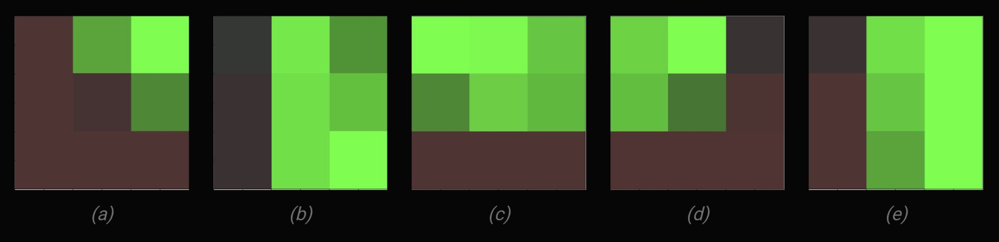


We've intentionally not labeled the receptive fields because the labels and locations of patches are not visible to a convolutional kernel. 

Can we guess what they are? We can't do that without looking at the image patch $O$.  

-  We notice that `(b)` and `(e)` look like a vertical edge. After looking at $O$, we can deduce that `(b)` and `(e)` might be a subset of $\{I_{00}, I_{10}, I_{20}\}$.  
- `(a)` looks like the bottom of a curve coming from top and going to the right, we can therefore guess that `(a)` is $I_{20}$.  
  - This makes `(b)` and `(e)` form the set $\{I_{00}, I_{10}\}$
- Similarly, `(c)` is $I_{21}$, `(d)` is $I_{22}$.  

The point is, we can't know what pattern $L_0$'s input had, without looking at the input patch of $L_2$. The converse is also true, just by looking at the input $L_2$, we can't surely say what the exact input actually was. As an example, the image `(d)` is an incomplete horizontal line, it could be a full horizontal line and we might get the exact same output (with the same pixel intensity).   

Taken together however, we can make reasonable guesses about what the input pattern might look like. They "disentangle" the input pattern that we detected in $L_2$.   

> We want to label every pattern that is detected by every single neuron in the network. The graph formed by these labels uniquely identifies what the network "thinks" about the input image. Every graph points to a unique pattern.   

There are many problems however, with this manual approach of assigning a concept to each number.  

- It is very laborious and can't scale. It also gets very boring after the initial novelty wears off.
- Labeling manually is also very subjective, do you keep a diagonal at 45 degrees in the same label as a diagonal at 50 degrees?  
- Perhaps the biggest problem is that convolutional kernels are 3D, not 2D. It is quite hard to spot patterns in this case.  

It is now useful to step back and think about what we are doing when we say "the kernel detected a horizontal line at this location". We are essentially grouping the unique patterns a convolutional kernel finds. Clustering does this for us automatically. 

Can we cluster the input patches $I_{rc}$ directly to assign a cluster label to every number $O_{rc}$? There is one small problem though. Weights (denoted by $W$) of a convolutional kernel can be quite sparse. If there is a near 0 value in the weight, it does not matter what the corresponding input number is. This can confuse our clustering algorithm.   
We instead cluster the Hadamard Product of the the weight $W$ and the input patch $I_{rc}$. This makes more intuitive sense too, we are clustering the patterns a convolutional kernel "likes".   
In this article, the Hadamard Product is used interchangeably with the phrase "pointwise multiplications".   


There is one more engineering challenge. The dataset for clustering for a given neuron would be huge, even for a modest number of images. It is not feasible to cluster them all. To address this, we filter the dataset to retain only points with high attribution for the target class.  
We assume here that points with low attribution are "noise" and thus can be ignored.

---

This article is only about labeling. We will see that we get remarkably far by just labeling.  


::: {.callout-note collapse="true" title="On dictionary learning"}
The literature is filled with examples of people trying to find patterns out of activations of a layer. Clustering directly on raw activations has not given good results in this specific endeavor.
The dominant position in the field is to use Dictionary Learning [@OLSHAUSEN19973311] to decompose an activation into a sparse linear combination of a set of basis vectors. Each basis vector encapsulates a "meaning" or a "concept".

Dictionary learning is really good at reconstructing all the examples in a dataset, it is quite resistant to noise and therefore is a very attractive option. The main problem is that dictionary learning can give multiple non-zero coefficients for reconstructing a single example. This is hard to reason about in terms of disentanglement.

It turns out that our approach — clustering the Hadamard product rather than raw activations — does work well. It is also very interpretable. A single label, for each concept, is perfect for disentanglement. An added advantage is that clustering is significantly faster than Dictionary Learning.

We will see however, that our clustering might not be the right answer in the end. It has marked many patterns as noise simply because of the curse of dimensionality. It does however, give us more data about a neuron, in a very efficient way.

:::


# Algorithm

For a given kernel at output channel $C$ for convolutional layer $L$ (i.e. a neuron), we want to assign a label to each output activation $O_{rc}$, which captures the concept the neuron detected at the location $(r,c)$ in the output activation $O$.  

::: {.aside}
Note that we are assigning the concept to points in the **output** activation, not the input.
:::


All experiments use a filtered subset of the [ImageNet-1K](https://huggingface.co/datasets/ILSVRC/imagenet-1k) [@DBLP:journals/corr/RussakovskyDSKSMHKKBBF14] validation split. We exclude images containing objects from multiple categories, then sample 32 images per class, yielding 32,000 images across 1,000 classes.


---

- **Compute attributions.** Use Integrated Gradients [@DBLP:journals/corr/SundararajanTY17]  to compute, for each image in the dataset, the contribution of every output activation of the neuron toward the predicted ImageNet category. 
  - Two algorithms were considered for calculating attributions: Integrated Gradients and DeepLIFT [@DBLP:journals/corr/ShrikumarGK17]. In the initial experiments, DeepLIFT was observed to find fewer examples per cluster. This is not thoroughly validated, and may be an artifact of iterative exploration of methods in the early testing.

- **Identify high-attribution points.** For each ImageNet category, find a positive and negative attribution threshold independently using the elbow method. There is no global threshold — each category is thresholded separately. Since the downstream clustering algorithm handles noise, the threshold only needs to coarsely filter out low-attribution points; it does not need to be precise. More details in the [Appendix](#on-attribution-thresholds).  

- **Extract the dataset.** For each high-attribution activation, extract the corresponding input patch of shape `[C_in, K, K]`, where `C_in` is the number of input channels and `K` is the kernel size — this patch represents the local receptive field of that spatial location. Take the Hadamard product of each extracted patch with the neuron's learned weights, flatten, and L2-normalize the result. These vectors form our dataset $\mathcal{D}$.
  - Specifically `sklearn.preprocessing.normalize(data, "l2")` was used for normalizing. Clustering results are not good without this normalization.
  - Dimensionality reduction like PCA and UMAP have tendencies to give uninterpretable and bad clusters, these are not therefore not used for any preprocessing.
  - We will see why L2-normalization was important for getting good cluster results [later in the article](#analysing-the-connection-with-the-previous-layer).

- **Cluster.** Run a clustering algorithm (HDBSCAN [@10.1007/978-3-642-37456-2_14]) over $\mathcal{D}$. Each point is assigned a cluster label, with `-1` reserved for noise.
  - HDBSCAN  was used with the settings `cluster_selection_method=leaf`. The `eom` method was observed to collapse different categories into the same cluster. `min_cluster_size` was tweaked to get "good" clusters. In our experience, same settings worked reasonably well for a whole layer.  

---


**Visualisation**

After this process, we have assigned a label to each number in the output activation of our neuron. It is not easy to interpret the clustering results. An example cluster:  

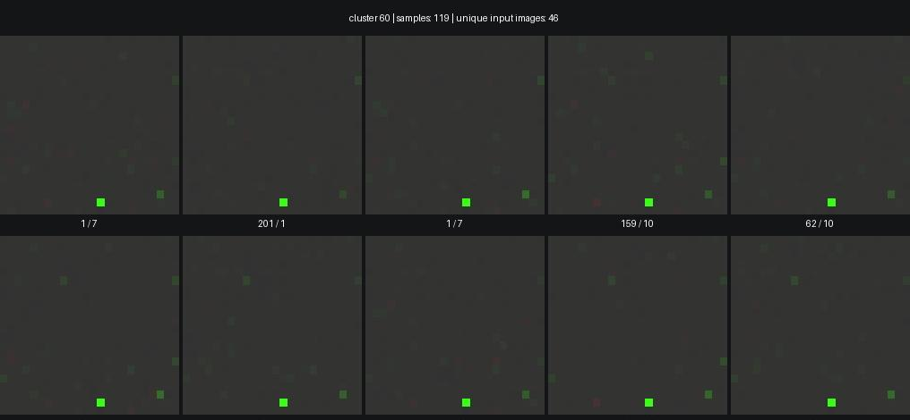

::: {.callout-important}

Although each sample is visualised as a 2D image, in reality, these are 1D vectors, we reshape these vectors for easier visualisation. In the case above, the actual vector has shape `(528,)` and it was reshaped to `(22,24)` for easier visualisation.  

This convention is followed throughout the article.  

:::

We would like to see the cluster in terms of the input image. To understand what each point represents, we want to visualise the part of input that affected it the most.  We can use [Neuron Attribution](https://captum.ai/api/neuron.html), which attributes every pixel in the input image to a specific output activation. We overlay the attribution on top of the input image, giving us a convenient unified view. Applying this technique to the points in the cluster shown above, we get the following overlays:


::: {.aside}

Notice the bright green or bright red spots in the images below, those are the attribution overlay points.  
As before, a brighter green means a higher positive value. A brighter red means a negative value with higher absolute value.  
Absence of any overlay/color means that the attribution of that pixel is close to 0 (it does not affect the activation we are interested in).  

For the examples above, we see bright green spots on the snouts of these animals.  
:::

For these overlays specifically — a separate step from the clustering-attribution filter described above — we have used DeepLIFT because its quality is comparable to Integrated Gradients and is substantially faster (see [NeuronDeepLift](https://captum.ai/api/neuron.html#neuron-deeplift)).


# mixed4e_1x1_pre_relu_conv:55

::: {.fig-inline-right}
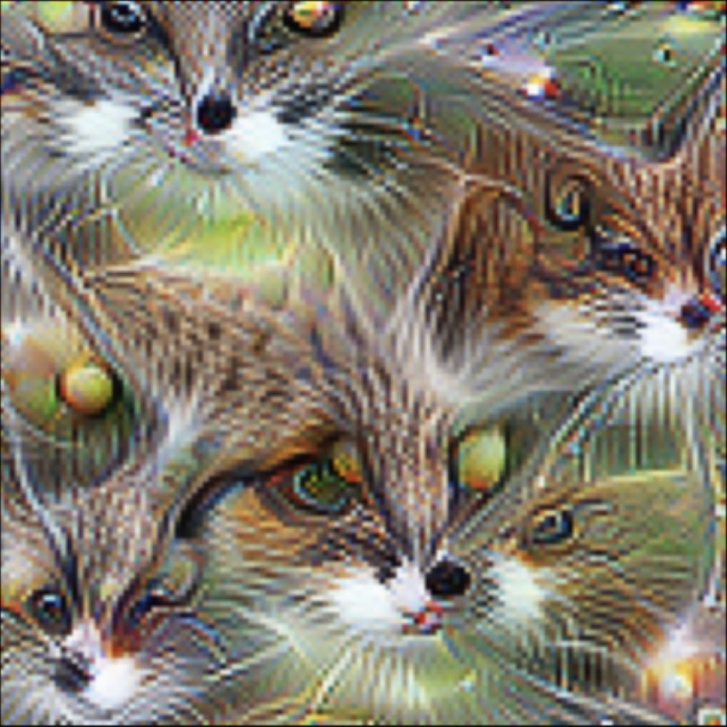
:::
`mixed4e` is a concatenation of four parallel branches in the Inception module. Since we work with convolutional layers, we trace back to the first ancestral convolutional neuron preceding `mixed4e:55`, which is `mixed4e_1x1_pre_relu_conv:55`. On the right, we have the feature visualisation of this neuron, confirming that it has similar characteristics to `mixed4e:55`.  


The results of the clustering setup described in the previous section are presented below.  

::: {.panel-tabset}

## Dog Legs

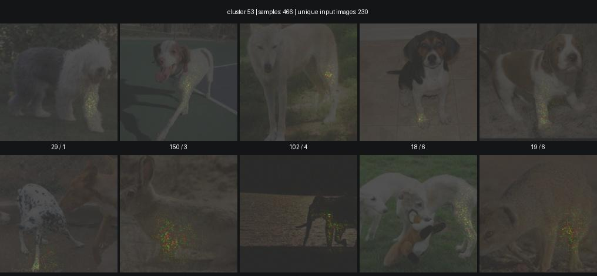{.toggle-img data-alt="./images/mixed4e_55_clusters/acts/dog-legs.jpeg"}

## Background

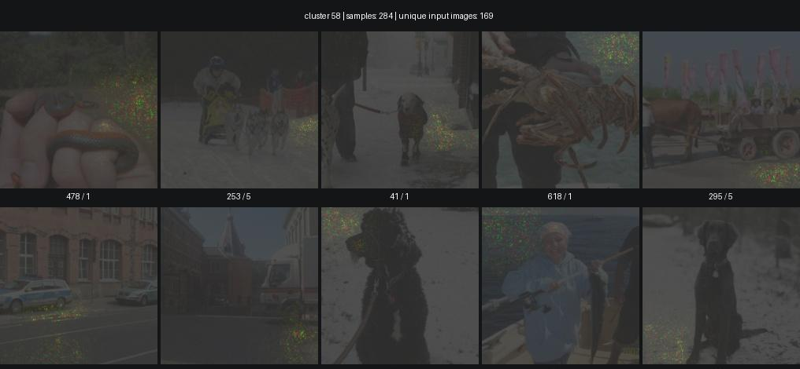{.toggle-img data-alt="./images/mixed4e_55_clusters/acts/background.jpeg"}

## Human Finger/Skin/Hand

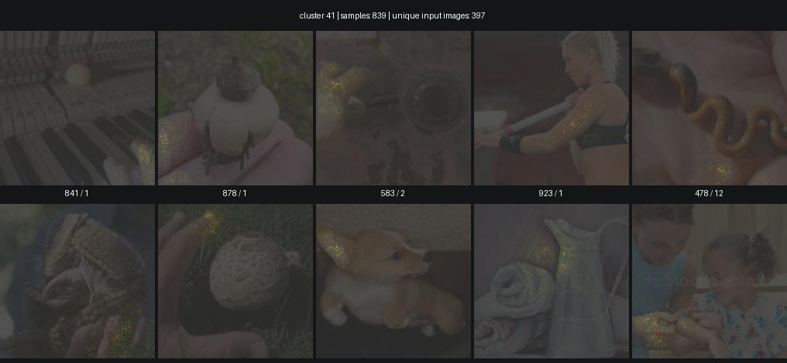{.toggle-img data-alt="./images/mixed4e_55_clusters/acts/human-finger-skin-hand.jpeg"}

## Letters

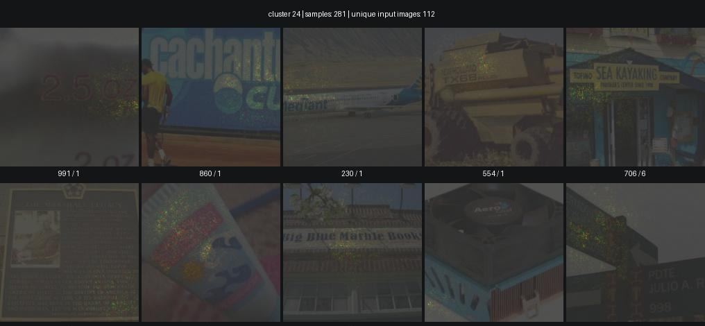{.toggle-img data-alt="./images/mixed4e_55_clusters/acts/letters.jpeg"}

## Car

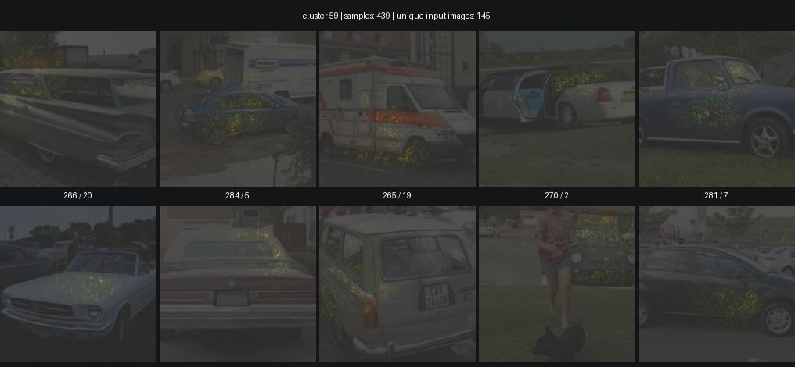{.toggle-img data-alt="./images/mixed4e_55_clusters/acts/car.jpeg"}

## Dog Stomach

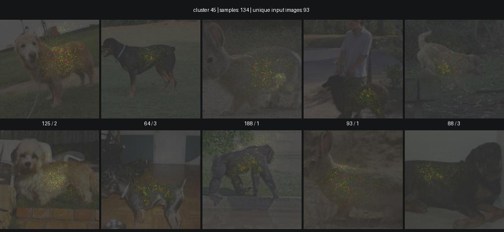{.toggle-img data-alt="./images/mixed4e_55_clusters/acts/dog-stomach.jpeg"}

## Top of Human Faces

{.toggle-img data-alt="./images/mixed4e_55_clusters/acts/human-face.jpeg"}

## Food

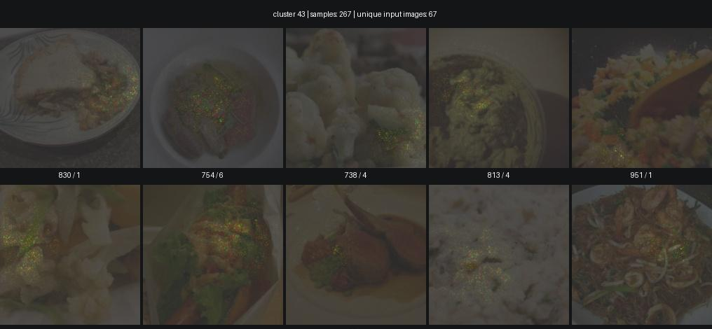{.toggle-img data-alt="./images/mixed4e_55_clusters/acts/food.jpeg"}

## Mountain

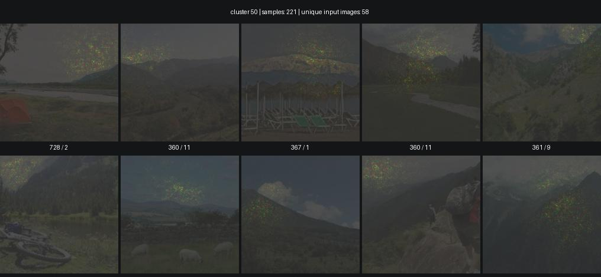{.toggle-img data-alt="./images/mixed4e_55_clusters/acts/mountain.jpeg"}

## Human Leg Clothes

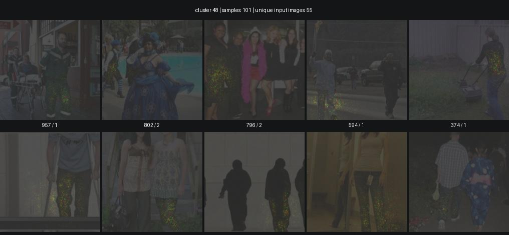{.toggle-img data-alt="./images/mixed4e_55_clusters/acts/human-leg-clothes.jpeg"}

## Fox

{.toggle-img data-alt="./images/mixed4e_55_clusters/acts/fox.jpeg"}

## Cat

{.toggle-img data-alt="./images/mixed4e_55_clusters/acts/cat.jpeg"}

## Mushroom

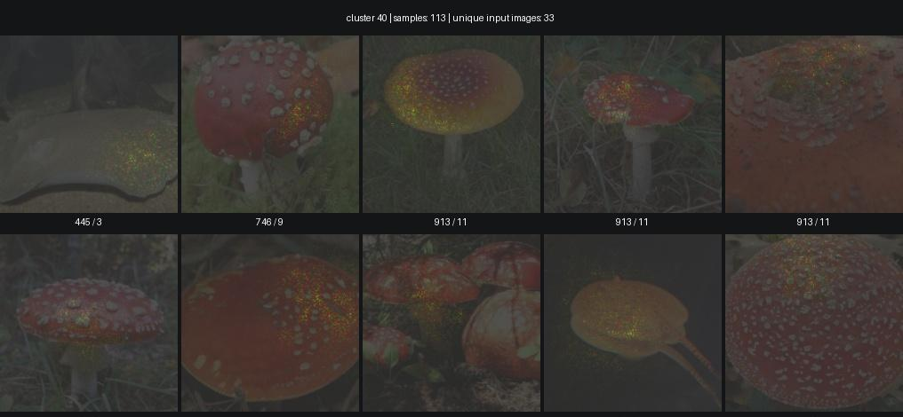{.toggle-img data-alt="./images/mixed4e_55_clusters/acts/mushroom.jpeg"}

## Human Faces

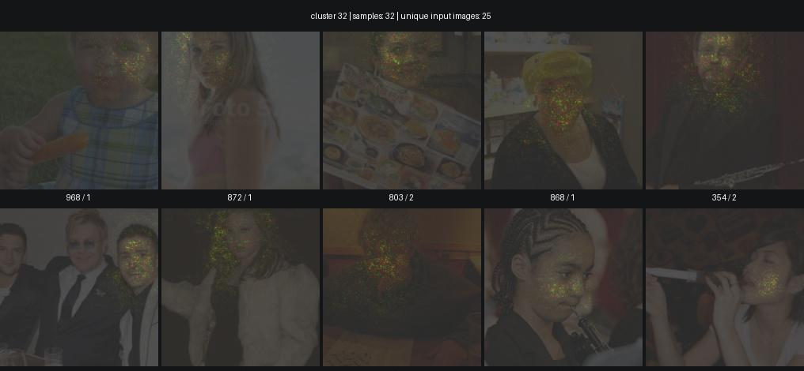{.toggle-img data-alt="./images/mixed4e_55_clusters/acts/human-faces--again-.jpeg"}

## Corn-like

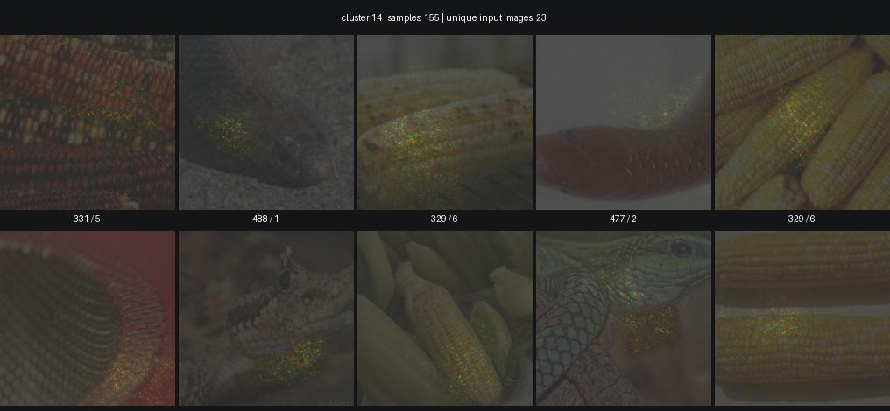{.toggle-img data-alt="./images/mixed4e_55_clusters/acts/corn-like.jpeg"}

## Snake

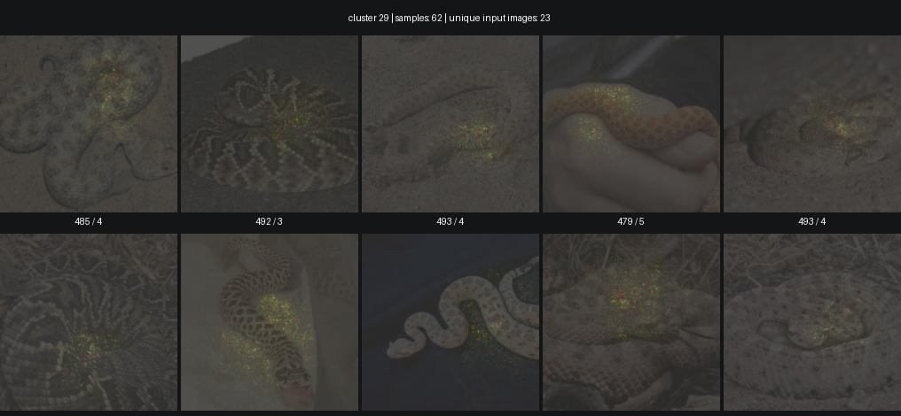{.toggle-img data-alt="./images/mixed4e_55_clusters/acts/snake.jpeg"}

## Soup-like

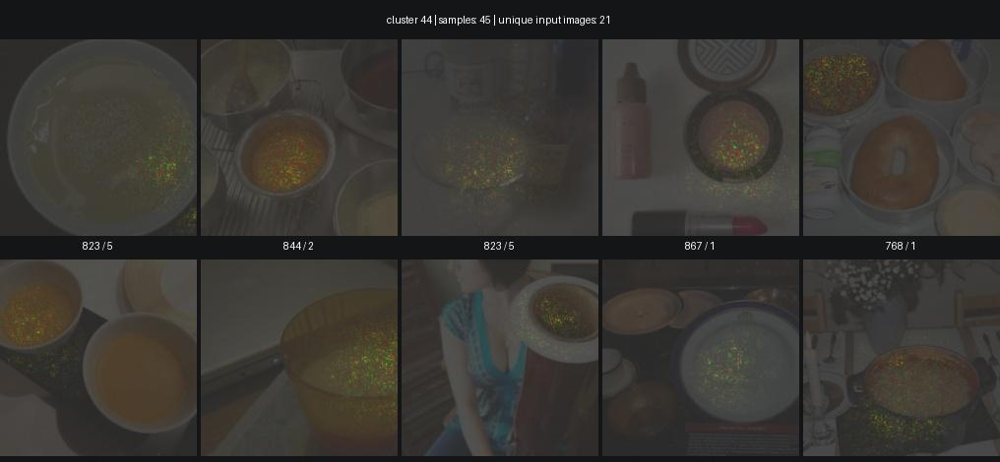{.toggle-img data-alt="./images/mixed4e_55_clusters/acts/soup-like.jpeg"}

## Fish

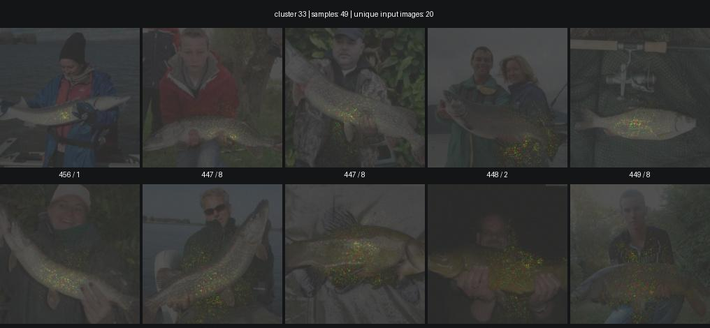{.toggle-img data-alt="./images/mixed4e_55_clusters/acts/fish.jpeg"}

## Thin rod-like

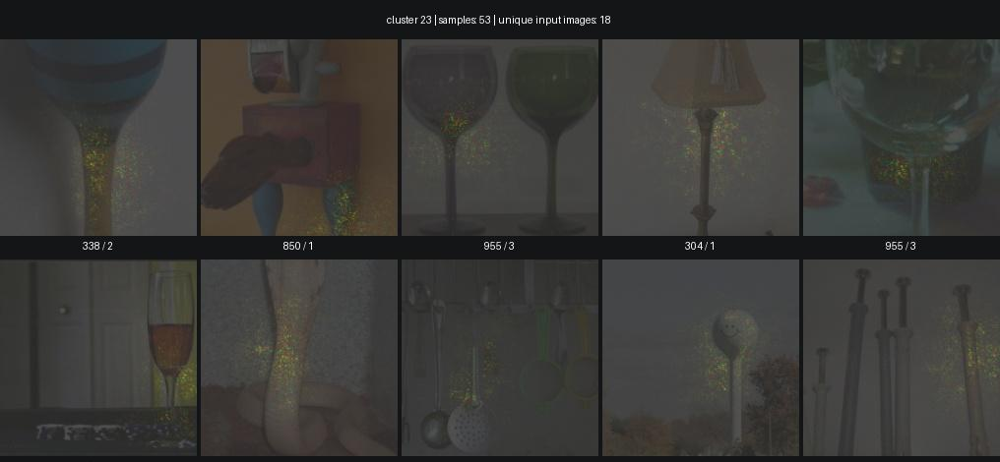{.toggle-img data-alt="./images/mixed4e_55_clusters/acts/thin-rod-like.jpeg"}

## Salamander

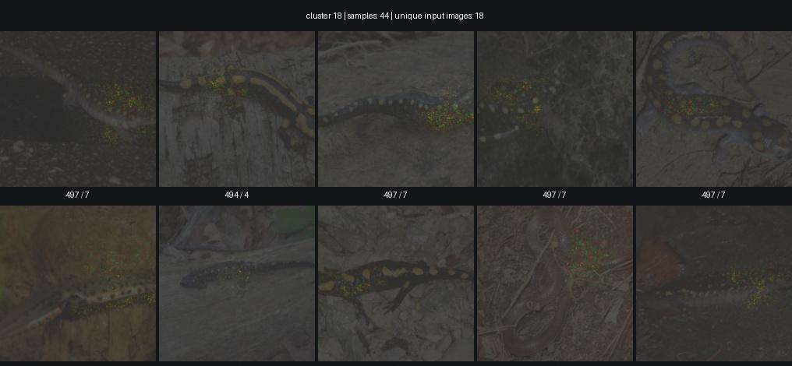{.toggle-img data-alt="./images/mixed4e_55_clusters/acts/salamander.jpeg"}

## White dog stomach

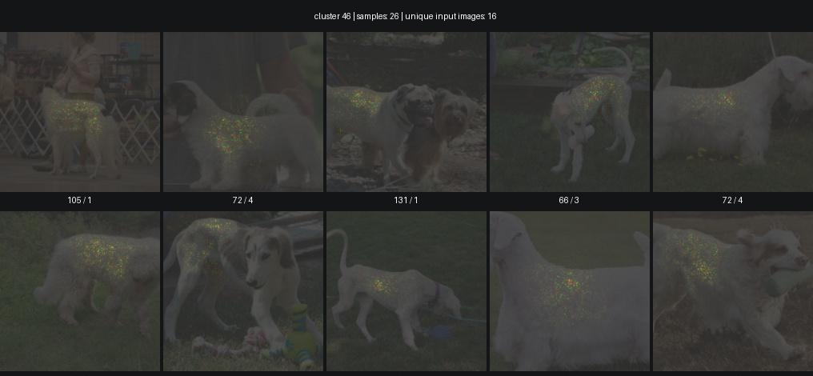{.toggle-img data-alt="./images/mixed4e_55_clusters/acts/white-dog-stomach.jpeg"}

## Criss-crossing White Rods

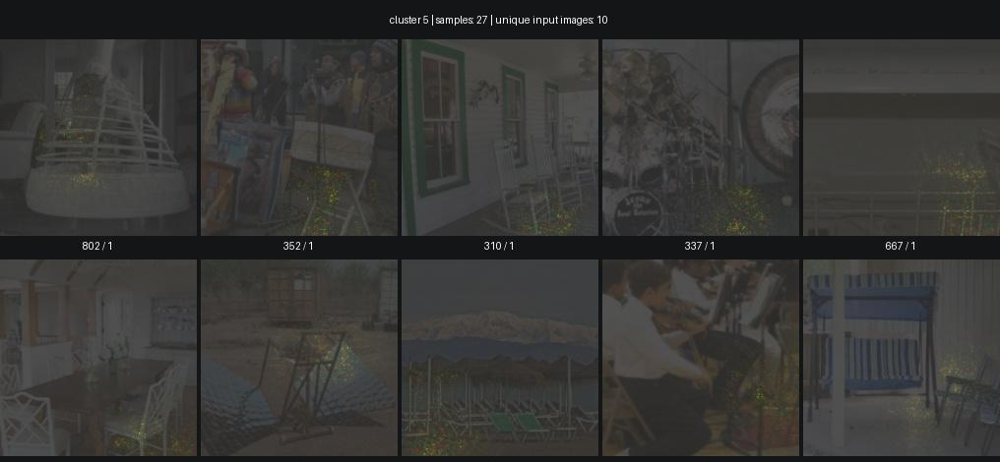{.toggle-img data-alt="./images/mixed4e_55_clusters/acts/criss-crossing-white-rods.jpeg"}

## Arc-like Edge

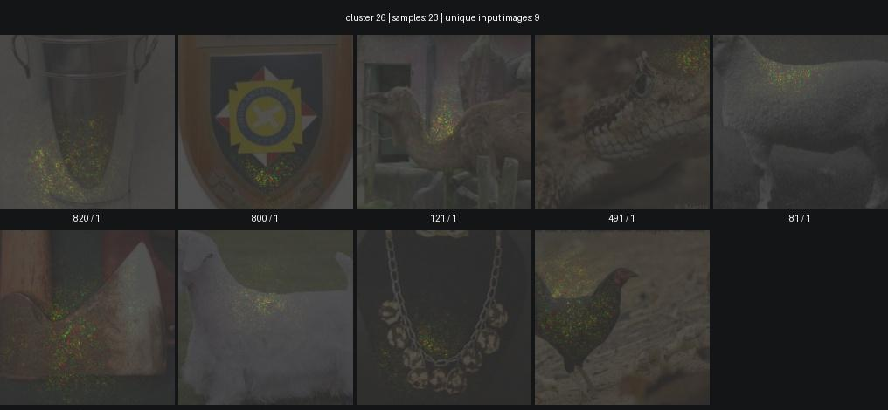{.toggle-img data-alt="./images/mixed4e_55_clusters/acts/arc-like-edge.jpeg"}

## Repeated Vertical Lines

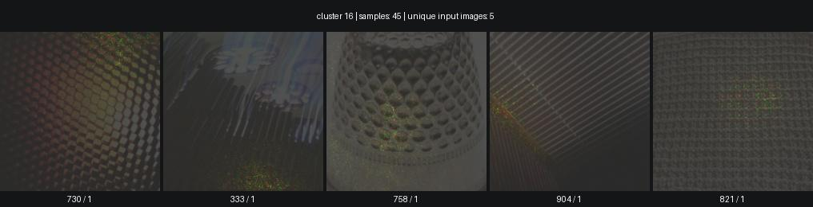{.toggle-img data-alt="./images/mixed4e_55_clusters/acts/repeated-vertical-lines.jpeg"}

:::

<div class="gallery-toolbar" style="margin-bottom: 25px;">
[Click to See Raw Clustered Pointwise Multiplications]{#toggle-image-set .btn .btn-outline-primary role="button"}
</div>

<script>
document.addEventListener("DOMContentLoaded", function() {
  const toggleBtn = document.getElementById("toggle-image-set");
  const images = document.querySelectorAll(".toggle-img");
  
  let showingAlt = false;

  toggleBtn.addEventListener("click", function() {
    showingAlt = !showingAlt;
    
    images.forEach(img => {
      // Swap the current src with the stored data-alt attribute
      const currentSrc = img.getAttribute("src");
      const altSrc = img.getAttribute("data-alt");
      
      img.setAttribute("src", altSrc);
      img.setAttribute("data-alt", currentSrc);
    });

    // Update button text to reflect current state
    if (showingAlt) {
      toggleBtn.textContent = "Switch back to input image visualisation";
      toggleBtn.classList.remove("btn-primary");
      toggleBtn.classList.add("btn-secondary");
    } else {
      toggleBtn.textContent = "Click to See Raw Clustered Pointwise Multiplications";
      toggleBtn.classList.remove("btn-secondary");
      toggleBtn.classList.add("btn-primary");
    }
  });
});
</script>


::: {.callout-tip title="How to interpret the visualisation"}
Each tab represents a cluster, I've assigned a human-readable label after looking at them.  
You can click on the `Click to See Raw Clustered Pointwise Multiplications` button above to see the raw pointwise multiplications used in clustering corresponding to the visualised overlay.  

Each image has a `<number>/<number>` title. The first number is the ImageNet label of that image, the second number is the count of unique images with at least one activation clustered in this category.  

The visualisation is done by taking the first 2 rows for each cluster from the full report: [HDBSCAN Cluster min_cluster_size=20 min_samples=5](reports/clusters/mixed4e_1x1_pre_relu_conv/55/index.html). The full report is useful for verifying the results hold across more samples. This convention is followed in the full cluster reports as well. It also has more clusters, we have shown a subset here.  
:::

The results are quite surprising. 

- We see the familiar categories `Cat`, `Fox`, and `Car` from the neuron's feature visualisation.
- There is substantial disentanglement here. Almost all the clusters are clean, monosemantic concepts.  
  - The initial assumption was that extracted the full graph of every output activation tagged with a cluster label would be necessary for disentanglement; the labeling process alone has taken us surprisingly far.
- We see many more cluster types: letters, human faces, and more. The neuron appears to be more polysemantic than initially suspected.
- The number of total points in a cluster generally exceeds the number of unique images in that cluster for many cases, meaning the same label is found multiple times within a single image. This is analogous to a diagonal edge detector activating multiple times along a long diagonal.


There is one notable concern:

- The majority of points were marked as noise — specifically 239,060 points.   
  - The raw pointwise multiplication vectors reveal very clean clusters, which makes the sheer volume of noise all the more concerning. Is this a coincidence? We address this in the next section.

::: {.callout-caution}
Many times, we find clusters which were generated by a highly repeating pattern from just a single image (imagine something like a honeycomb).   
Ideally, we would include them in the cluster reports, but the report generation can get very time consuming if you try to add these tiny clusters, hindering large scale clustering to analyse layers. In this article, all reports won't include clusters generated by patterns from only a single unique image.  
:::


## Labeling feature visualisation

Our algorithm marks the majority of the dataset as noise, with cluster points being quite rare. This raises an important question: are these patterns genuinely meaningful, or did we simply find them because of the sheer size of the dataset?

In this section, we use our pretrained model to categorize the patterns our neuron finds on images generated using feature visualisation. The cluster model categorizes many points to the `Fox` category (and sometimes `Cat`). Overlays of a subset of these points are shown below.    

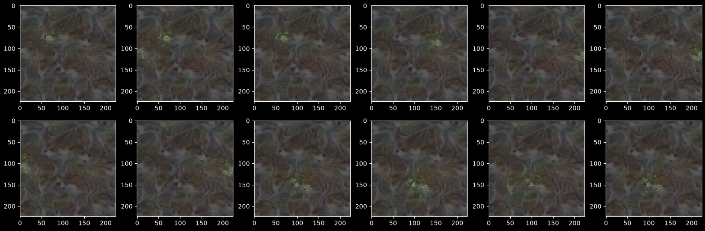

We observe that many of the snouts were correctly detected by our pretrained cluster model. This is a comforting result for us. We can be now confident that feature visualisation itself is generating these rare patterns for activating our neuron, at least for snouts.   

If these patterns were purely coincidental and carry no meaningful role in the model's final output, it would imply that feature visualisation itself is misleading us. Together, these results give us sufficient confidence to move forward with this approach.

All is not well, however. Our model consistently categorises the feature visualisation of car windows as noise, across every region in the image.


::: {.callout-important}


As with all unsupervised learning approaches, there are challenges with clustering here too. We consistently observe that HDBSCAN fails to recover all the points belonging to a given cluster. It is too strict and puts a lot of data in noise.
Whether clustering is the right tool for this job is a question we are not going to explore in this article.
It does give us more data on analysing the behavior of a specific neuron, which will be the topic of the next sections.

Since clustering misses points for any given cluster, we analyse the behavior of clusters across many example images, instead of using a single image. As an example, if you want to check which neurons fired before a certain neuron, you won't get the full list (or even close to the full list) on just analysing a single neuron.
Looking at a single cluster across many examples, instead of a single example, gives us a much more complete picture of which previous-layer neurons it depends on.


For a given random sample, we also use cosine similarity to find the closest cluster as a proxy. This can give varied results, since the similarity number is not very reliable. All reports that do this include the samples alongside their closest matches. Readers should inspect the matches by eye to judge whether it is a true match or just noise. In our experiments in this article, noisy matches are generally uncommon.   

:::

We now move on to analyse why feature visualisation ends up giving us so many fox-like images.  

## Why does feature visualisation like cats/foxes/cars?

Below, we have the scatter plots of the output activations for every categorized point.  

.](./images/activation-graphs-mixed4e-pre-relu-conv-55/all.jpeg)

We clearly see `Cat`, `Fox` and `Car` having higher activation values. `Car` however has a lower activation range than the other two, which might be the reason that we need to force a diversity term to make feature visualisation produce cars.  


::: {.fig-inline-right}
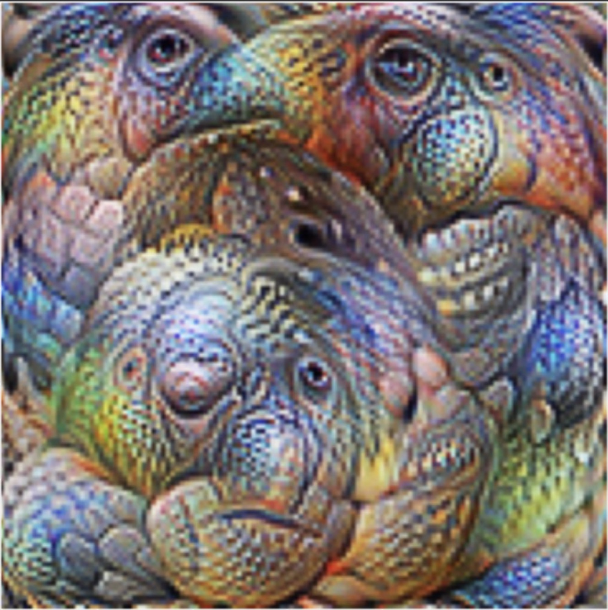
:::

Interestingly, human face has it's own negative band (around -200). On the right, we notice that there is a trace of a human face in feature visualisation too (teeth and eyes). There is also, weirdly, an eagle like entity.  


Given that we have identified distinct groups of patterns, can we force feature visualisation to reproduce them?

We take the following approach:

- To recap, the neuron in question is `mixed4e_1x1_pre_relu_conv:55`, with a kernel size of `1x1` and an output shape of `[14, 14]`. Its preceding layer, `mixed4d`, produces outputs of shape `[528, 14, 14]`.
- Suppose our clustering model predicted `cat` at position `[4, 5]` in the neuron's output, with `act = input_activation[:, :, 4, 5]`. We want to force feature visualisation to recover this activation. Optionally, we can also ask feature visualisation to recover the pointwise multiplication `act * layer.weight[55, :, :, :]`.  
  - This is simply done by minimising MSE with the given vector.  


With this method, we end up getting very predictable results, shown below:

::: {.panel-tabset}

## Human Finger/Skin/Hand

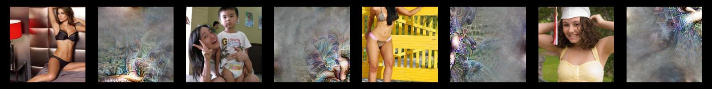

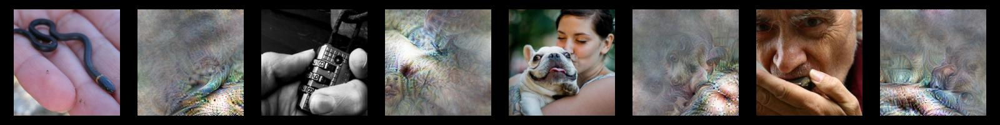


## Background

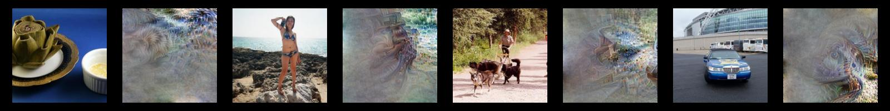

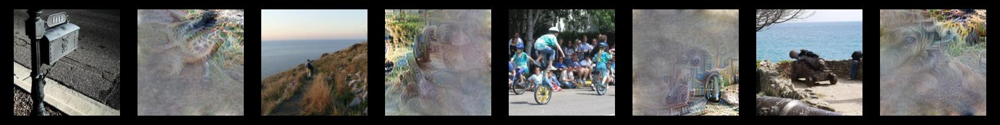

## Dog Legs

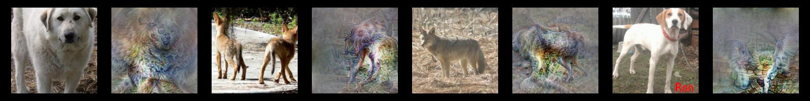

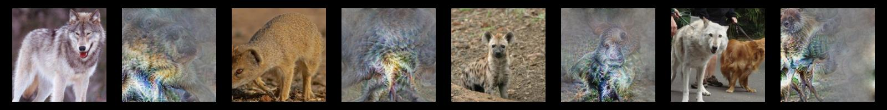

The visualisations don't seem to have any specific color component

## Letters


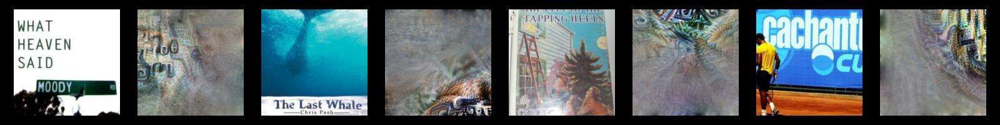

Notice the rune-like structures

## Car

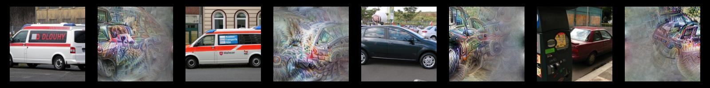

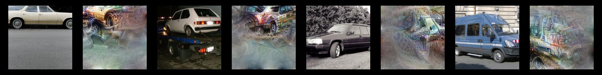

## Dog Stomach

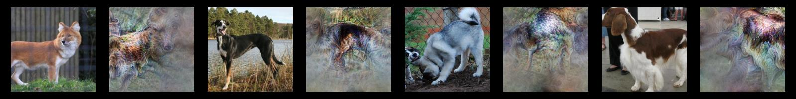

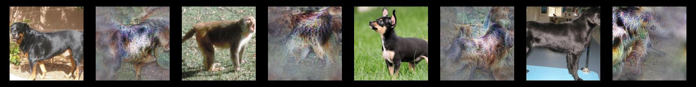

## Human Face

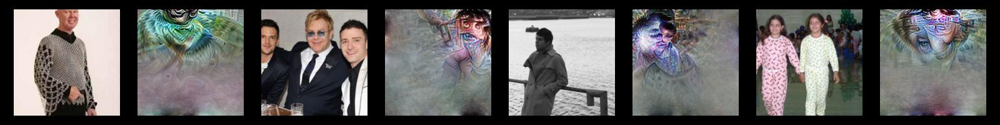

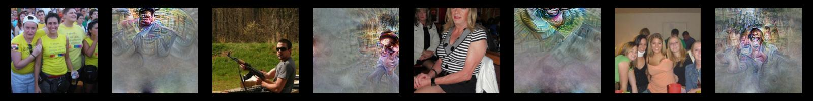


## Food

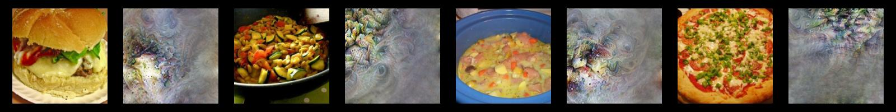

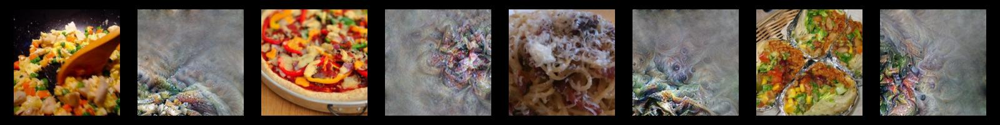

## Mountain

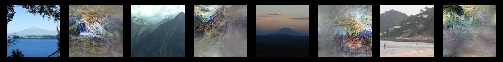

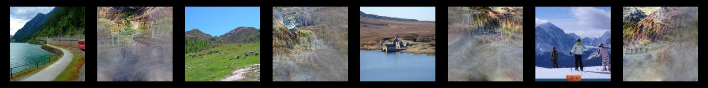


## Human Leg Clothes

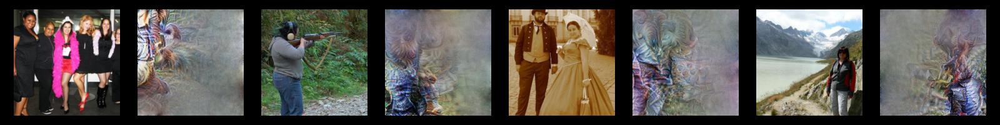


## Fox

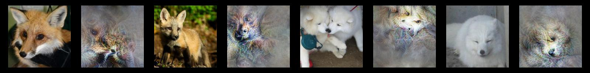

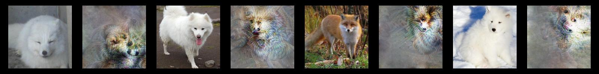


## Cat

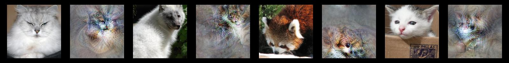

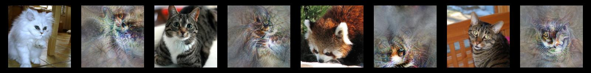


## Mushroom


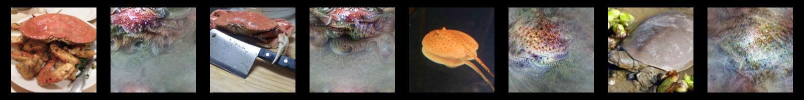

## Human Faces (again)

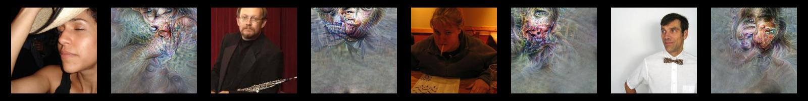


## Corn-like

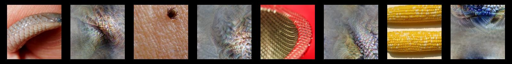

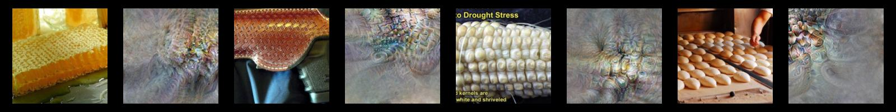

## Snake

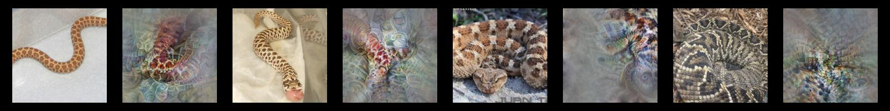

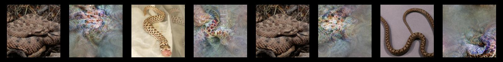

## Soup-like

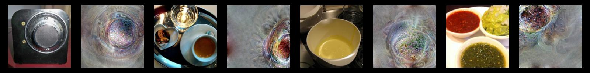

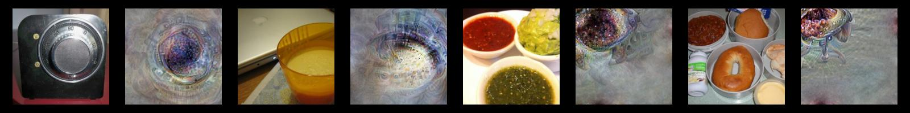

## Fish

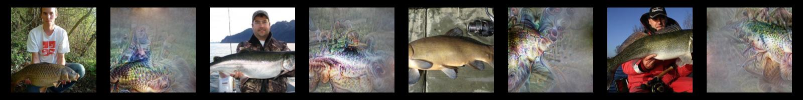

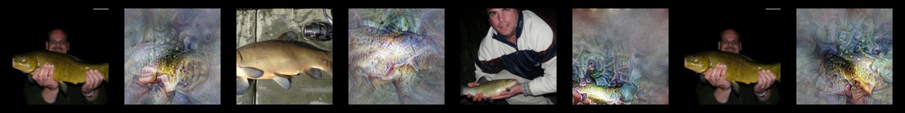

## Thin rod-like

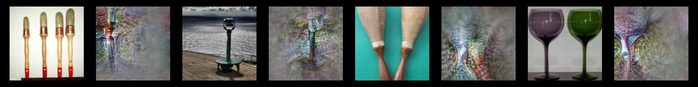

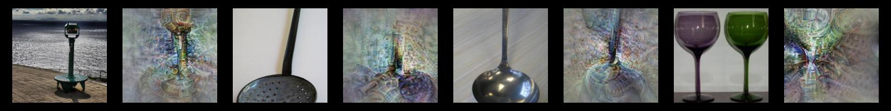

## Salamander

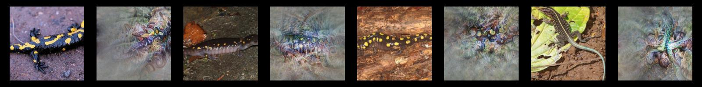

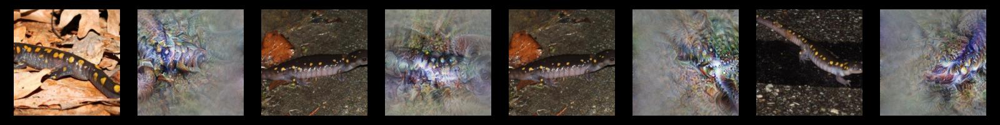

## White dog stomach

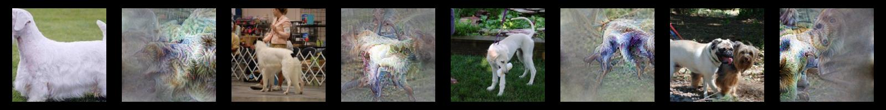

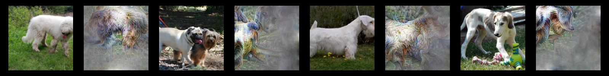


## criss-crossing white rods

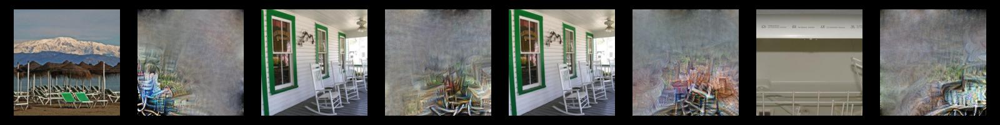

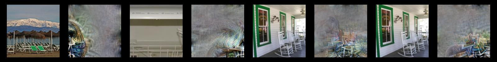

## arc-like edge

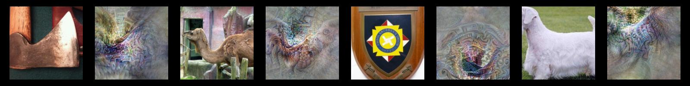

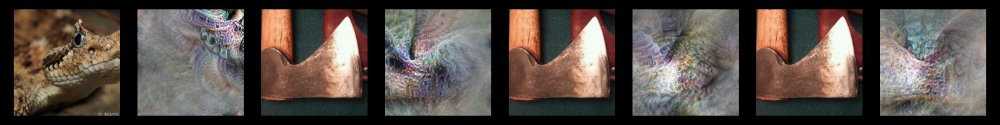

## repeated vertical lines

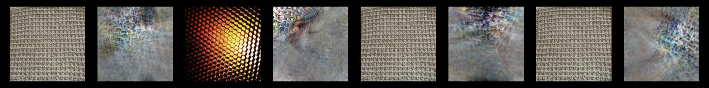

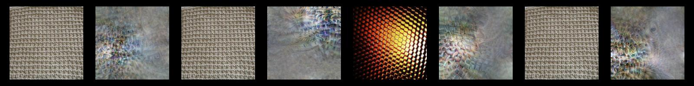

:::

Some observations from the panel above:

- **Noise-colors:** When a feature visualisation isn't encoding specific information, it consistently shows a gray tone or a mix of green, blue, and pink swirls. We call this pattern noise-colors, and use the term throughout below.
- **Human skin:** The cluster shows skin-colored patches and consistently keeps humans together. Color is clearly encoded here; whether a human shape is also encoded, or color alone drives cluster membership, is unclear from this data.
- **Dog legs:** Visualisations show a specific shape with no consistent color, colors present are noise-colors.
- **Dog stomach:** No specific color is required for cluster membership, but the visualisations pick up traces of the color from the source example.
- **Cats:** Harder to interpret than the other clusters. Visualisations vary across eyes, nose, and full-face crops, with no clear common feature.
- **Human faces (two categories):** The second category consistently encodes skin color. The first is mixed, some examples show noise-colors, others a darker skin tone.
- **Soup-like:** Liquid inside a circular shape; noise-colors.
- **Thin rod-like:** Noise-colors.
- **White dog stomachs:** A clean result, the cluster contains only white dogs with overlays on their stomachs, and the feature visualisation consistently produces white.
- **Criss-crossing white rods:** Faint white shades dominate, though noise-colors also appear frequently.

Using feature visualisation together with a point's assigned cluster is a useful way to understand what a cluster is actually capturing. This technique would be used in reports in the next section when it is not clear what feature a cluster overlay represents.  


# Analysing the connection with the previous layer

What does it mean for a neuron to fire? We have evidence of neurons seeing patterns which do not result in a very high activation value from the neuron. Are these patterns meaningful? Before attempting to answer this question, we would first need to closely look at the range of output activation values for each cluster of a given neuron. These will be called activation ranges in the rest of the article.  


## Activation ranges

Below, we have the output activations for all clusters of neuron `mixed4e_1x1_pre_relu_conv:55`. The first tab contains the activation ranges of all clusters. The second tab excludes `Cat`, `Car` and `Fox`, helping us take a closer look at the other clusters. The third tab contains a scatter plot of randomly sampled activation output points (an approximation of noise).

::: {.callout-important}
In this section, we assign the maximum and minimum values for a given activation range by finding the most dense region containing 90% of the points and taking their maxima and minima.
:::

::: {.panel-tabset}

## All categories


## Categories other than `Cat`, `Fox` and `Car`


## Randomly Sampled points

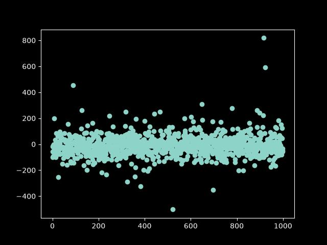

:::

- Noise is approximately `[-100, 100]`.
- `Car`, `Cat` and `Fox` have much higher activation values, and their ranges are also more spread out.
- There are two `human faces` clusters: the first has almost all its values under 100, and the second is fully negative.
- `Salamander`, `Snake`, and `repeated vertical lines` also have outputs very close to noise.
- `Mushroom`, `Thin rod-like`, `Dog Legs`, `Fish`, and `Letters` have many points outside the noise range, though they still intersect with it.

Here is another activation graph, for the neuron `mixed4d_pool_reduce_pre_relu_conv:29`.


::: {.panel-tabset}

## All categories


## Only positive categories


## Randomly Sampled points

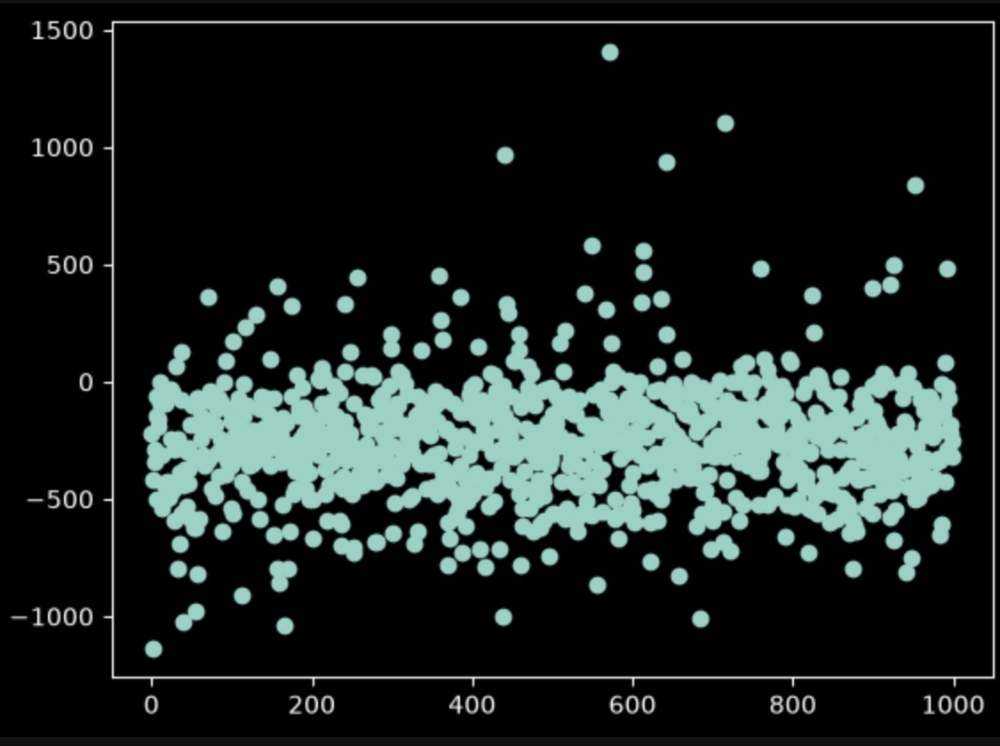

:::

The noise output of this neuron is not centered at 0; it's very negative. The bias is actually only `0.2168`, implying the weights are the source of this negativity.

- This neuron detects a lot of patterns, including several clusters for the same concept: 2 for `human faces`, 3 for `scaly skin`, 2 for `bird face`, 2 for `sky`.
- Both `bird face` clusters sit above noise, in fact with similar ranges. The rest are either driven below 0 or sit close to 0 (the upper bound of noise).

This is a strong filter: it detects many patterns and drives almost all of them below 0. Since the next neuron won't be able to find a `human-face` signal using this neuron's output, this is evidence of the network actively leveraging ReLU to create sparse signals. The most obvious behavior of ReLU is providing sparsity by zeroing out a part of the noise range. But here we see something more deliberate: neurons actively driving entire clusters below 0, making the neuron act like a filter that excludes a specific concept from its output for a sparser, cleaner signal.

An important hint here is that the neuron is using **both** the noise range and negative values for similar concepts. Is this by design? Does this mean that if a neuron outputs something in its noise range, it really is sending the signal "did not find a concept"?  


## What makes this neuron say "cat"

The pointwise multiplication of a random sample in the cat cluster is given below. The left image shows the raw vector. The right image is the same vector, but with the bright spot at `(20,13)` zeroed out, so we can better see the relative intensities of the other points (the intensities are not comparable between images).

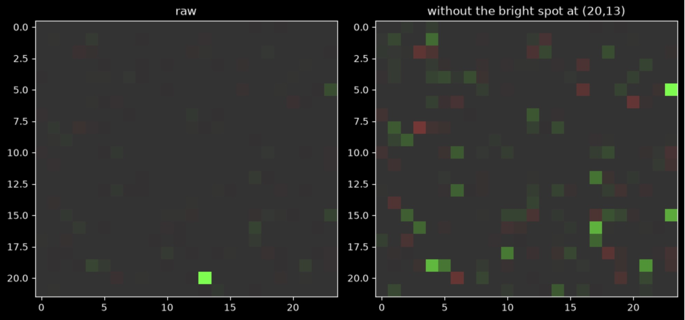

We will now describe the process used to analyse how each neuron in the previous layer contributes to a specific type of output (the pattern of the cluster in question).

In this process, each example is one instance of a pointwise multiplication belonging to the cluster being analysed (`cat` in our case).

- For each example, we keep the smallest set of largest-magnitude entries that account for 90% of its total absolute mass. These are the components actually doing the work for this particular firing; everything else is **assumed** as noise and dropped. 
- We map each input point to the neuron in the previous convolutional layer (for example, `pw[493] = relu(mixed4d_pool_reduce_pre_relu_conv:29)`), and look at the activation ranges of `mixed4d_pool_reduce_pre_relu_conv:29` (relu is excluded).

We repeat this across examples for all neurons that appear in the 90% sum set in any example. A card is used to provide data for each such neuron, as shown below.  

::: {.border .rounded .mb-2 .p-3}

::: {.d-flex .flex-nowrap .align-items-center .justify-content-between .border-bottom .pb-2 .mb-2}
**mixed4d_5x5_pre_relu_conv:1** [· Fired: 100.0%]{.text-body-secondary .small}

[59.7% (↑3.3%)]{style="color: var(--bs-success);"} 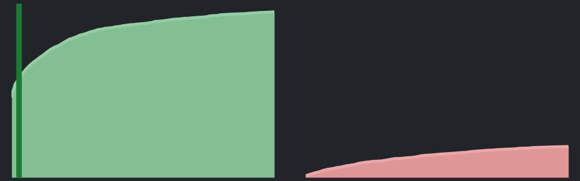{height=60px}
:::

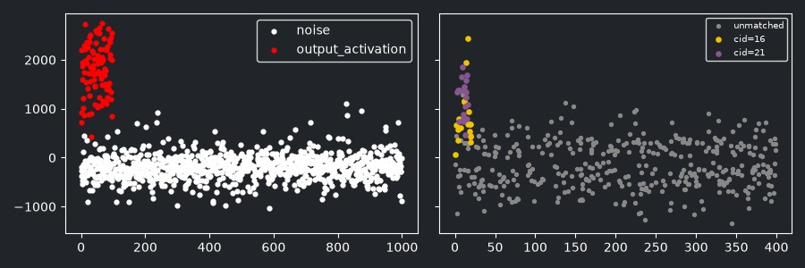

<div class="text-body-secondary small mb-1">Firing by cluster</div>

<div class="mb-2"><div class="d-flex align-items-center gap-2 mb-1"><div class="progress flex-grow-1" style="height: 6px;" role="progressbar" aria-valuenow="55.1" aria-valuemin="0" aria-valuemax="100"><div class="progress-bar bg-primary" style="width: 55.1%;"></div></div><span class="text-body-secondary small">cid=16 · 54 (55.1%) · median_sim=0.84</span></div>

<details><summary class="text-body-secondary small">show cluster photo</summary>

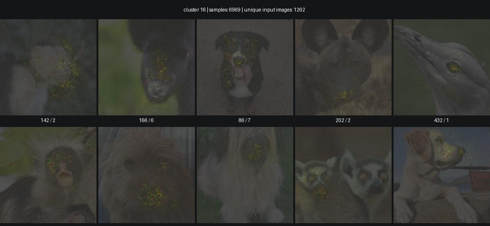

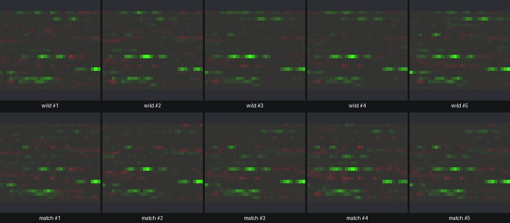

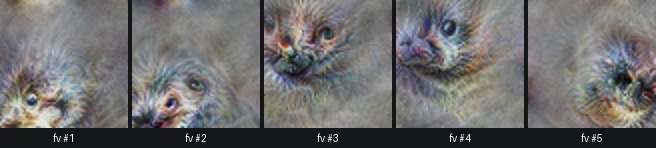

</details>

</div>

<div class="mb-2"><div class="d-flex align-items-center gap-2 mb-1"><div class="progress flex-grow-1" style="height: 6px;" role="progressbar" aria-valuenow="41.8" aria-valuemin="0" aria-valuemax="100"><div class="progress-bar bg-primary" style="width: 41.8%;"></div></div><span class="text-body-secondary small">cid=21 · 41 (41.8%) · median_sim=0.82</span></div>

<details><summary class="text-body-secondary small">show cluster photo</summary>


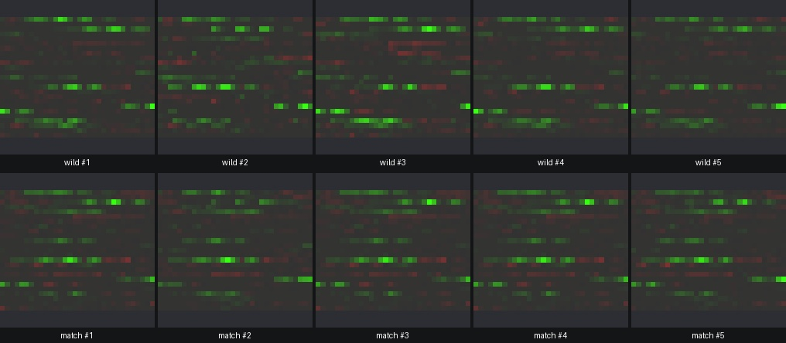

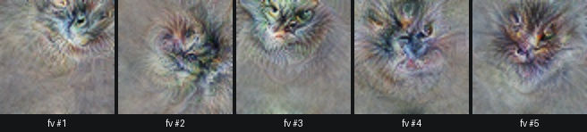

</details>

</div>

<details><summary class="text-body-secondary small">show outlier clusters (1)</summary>

<div class="mb-2"><div class="d-flex align-items-center gap-2 mb-1"><div class="progress flex-grow-1" style="height: 6px;" role="progressbar" aria-valuenow="3.1" aria-valuemin="0" aria-valuemax="100"><div class="progress-bar bg-warning" style="width: 3.1%;"></div></div><span class="text-body-secondary small">cid=14 · 3 (3.1%) · median_sim=0.78 · outlier</span></div>

<details><summary class="text-body-secondary small">show cluster photo</summary>

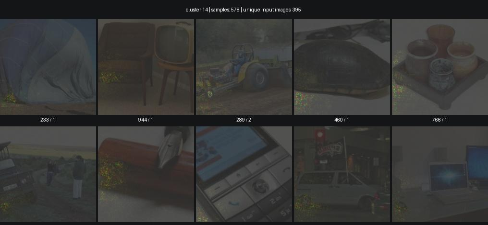

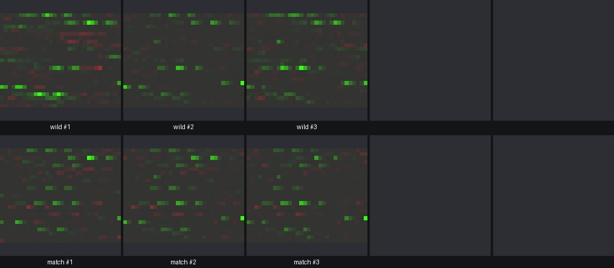

</details>

</div>

</details>


:::


**How to interpret this card:**

- Left part of header:
  - The neuron's name, along with its firing frequency. "Fired 100%" means this neuron was among the top elements making up 90% of the sum in 100% of the input examples.
    - This might be confusing, but we needed a word for our inclusion criteria. "Fired" is explicitly different from "activated," a state where we believe the neuron is sending a signal used by a consumer in the next layer; there is no concrete definition of "activated" right now.
- Right part of header:
  - Each neuron's contribution is always either positive or always negative, never both, since we work on a 1x1 convolution, the weight is fixed and ReLU has already stripped out negatives before this point. The small chart in the header shows where this neuron ranks among others pushing the output in the same direction.
  - Contribution is calculated as `output of neuron * firing frequency ratio` (so higher firing frequency carries more weight).
  - The chart shows two filled regions side by side: the cumulative sum of contributions from positive neurons (green) and from negative neurons (pink). A vertical line marks this neuron's position within its region.
  - The number shown is the running total through this neuron, with the change contributed by this neuron in parentheses (e.g., "59.7% (↑3.3%)" means this neuron and everything before it add up to 59.7% of the total, and this neuron alone accounts for 3.3% of that).
- Scatter plot:
  - One image with two side-by-side panels. The first shows `noise` (randomly sampled output activations for the neuron) against `output_activation` (the values observed from this neuron across examples where it was firing for cat). This activity is compared against pre-generated clusters using HDBSCAN, with cosine similarity used to find the closest match where HDBSCAN misses points.
  - The second panel shows points colored by matched cluster (e.g., `cid=16`, `cid=21`) against gray "unmatched" points, sampled from clusters whose pointwise multiplication never matched any example's pointwise multiplication.
- After the scatter plot, there is a section for each matched cluster. The bar shows the relative number of times this neuron's activity was matched with that cluster. An expandable `show cluster photo` section reveals the input overlay of the cluster, the pointwise multiplications found in the examples (wild samples), and their closest matches, stacked in two rows with each column a wild/closest-match pair. Feature visualisation for the wild samples is shown occasionally, when it helps clarify what's being caught.
  - The line `cid=16 · 54 (55.1%) · median_sim=0.84` means: Cluster ID 16, number of closest matches = 54, which was 55.1% of the total matches, with a median cosine similarity of 0.84.
- `Show outlier clusters` is another expandable section, containing expandable sub-sections for outlier clusters (closest-match rate below 10%). We don't generally look into these.
- The neurons are sorted by their firing frequency in descending order.  

Each report starts with a section containing some top-level information:

- An image of the overlay of the cluster whose dependencies are analysed in this report.
- 3 rows of two histograms each:
  - The left histogram in the first row plots the distance of each dependency neuron's output activation from the median of that neuron's noise range.
    - Different neurons have different noise ranges with different variances. We want to plot values that are comparable across neurons, so we use the noise radius, $max(noise) - median(noise)$, as the unit of distance.
    - For each output activation with value `o`, we calculate $\frac{o - median(noise)}{max(noise) - median(noise)}$ and plot it on the histogram.
  - The right histogram plots the fraction of neurons with `(output_activation - median(noise)) > 0.8*noise_radius` for each input example.  
  - The histograms in the second row do the same plots for only positive activations. The ones in the last row do it for negative activations.  

::: {#fig-act-noise-distance-histograms layout-ncol=2}

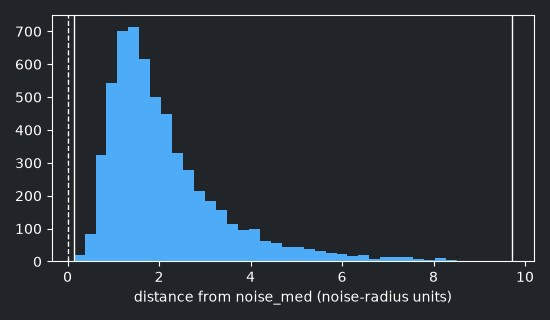

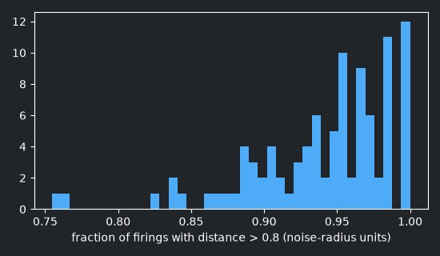

All output activation's histograms from report
:::


The full report is provided at [Report: Dependencies of mixed4e_1x1_pre_relu_conv:55[61]](./reports/dependency-reports/mixed4e_1x1_pre_relu_conv/55/61/report.qmd).

The main takeaways from the report are:

- There are a large number of neurons (134 fired for more than 10% of the examples) in the previous layer carrying various features. Many of them are, approximately, cat and dog faces.
- If you look at the histograms, you'll notice that a large fraction of neurons are consistently more than `0.8 * noise_radius` away from the noise median. A closer look at each neuron's card shows that:
  - The range of matched clusters is generally comparable to the observed output activation ranges.
  - They also sit in the higher range of all the clusters detected for that neuron, suggesting that top-activating clusters are the only contributors to signals for the next layer.
- There are times when the activation is in the right range, but the pattern of the pointwise multiplication is all wrong (the closest cluster match looks off). It's as if the signal is "faking" it.

Now onto some of the things that feel off:

- It is harder to reason about what the negative inputs are doing for high output activation examples.
- There are several neurons, like `mixed4d_5x5_pre_relu_conv:1` and `mixed4d_5x5_pre_relu_conv:60`, whose clusters contain `car wheels`. We suspect they're detecting black circular objects in general, such as eyes or a snout.
- `mixed4d_3x3_pre_relu_conv:31` has what seems like a polysemantic cluster. Feature visualisation seems to show black dots.

There are other neurons too; we ask the reader to take a look at them in the report, along with their feature visualisations (their contributions are smaller, though).

- mixed4d_5x5_pre_relu_conv:61
- mixed4d_5x5_pre_relu_conv:22
- mixed4d_3x3_pre_relu_conv:134
- mixed4d_3x3_pre_relu_conv:251
- mixed4d_3x3_pre_relu_conv:204
- mixed4d_5x5_pre_relu_conv:8
- mixed4d_3x3_pre_relu_conv:68
- mixed4d_pool_reduce_pre_relu_conv:24
- mixed4d_3x3_pre_relu_conv:22
- mixed4d_3x3_pre_relu_conv:258
- mixed4d_1x1_pre_relu_conv:22
- mixed4d_pool_reduce_pre_relu_conv:29

Even so, the bigger story seems clean: there is an overwhelming majority with cat-like or dog-like faces.

## "human faces": a cluster which does not give maximum activation

`cat` is a cluster with very high activations for `mixed4e_1x1_pre_relu_conv:55`. Is that the reason all its dependency neurons belong to clusters with high activations too? We can look at the `human faces` [report](./reports/dependency-reports/mixed4e_1x1_pre_relu_conv/55/31/report.qmd) to check this out.

- The most interesting part of this report is that both the positive **and the negative** dependencies consistently match the `human faces` concept. A substantial number of input neurons also have a distance from noise median greater than 0.8; they are "activated."
- The neuron seems to be using a simple strategy: assign some proportion of activated `human faces` inputs to positive weights, and assign the rest to negatives, while keeping the pointwise multiplication hovering around noise.
- A large fraction of output activations are more than `0.8 * noise_radius` too; low-output clusters also use input signals from neurons sending their signals through highly activated clusters.

There is another cluster of `human faces` (Cluster 32) for this neuron, whose range is entirely negative. Its report can be found [here](./reports/dependency-reports/mixed4e_1x1_pre_relu_conv/55/32/report.qmd). The story is very similar.


---

Putting this together, for `mixed4e_1x1_pre_relu_conv:55` we can conclude that it heavily gets its signals from "activated" neurons, i.e., neurons emitting a value far from the noise range. These inputs also match with the clusters that have top activations for that neuron, which in turn gives us a way of finding these ranges directly (or perhaps a simpler heuristic suffices: points `0.8 noise radius away from the noise median`). We observe the same pattern consistently across other neurons we randomly sampled from this layer, not just this one (see [Appendix: Neuron Reports](#neuron-reports)).

The simpler statement, that "maximum" is a sign of activation, is starting to hold up again. The other clusters are evidence of the neuron actively inhibiting signals from other concepts. When `mixed4e_1x1_pre_relu_conv:55` has a high output activation, it can be coded as a proposition `(cat OR snout OR car) AND ~(human_face OR letter OR mountain OR white_dog_stomach ...).   

A surprising result for us was the really large number of neurons activating for every pattern with similar concepts. Since so many neurons are used to identify the signal, the network seems to rely on something like a law-of-large-numbers effect: even if some signals are "fake," or some neurons are accidentally inhibited, the overall majority makes up for it. This fits well with what a convolutional kernel actually does: a Hadamard product followed by a sum. Addition acts like a soft OR gate — evidence from many neurons simply accumulates, so no single input needs to be reliable on its own for the aggregate signal to be trustworthy.

This is worth thinking about. Imagine you are a neuron: you fire when the previous layer's neurons feeding into you land in a specific set of ranges together, because that's literally the arithmetic you're doing, a weighted sum. Nothing about "direction" enters into that picture on its own.

Cosine similarity is the metric we (and much of the field, us included, see [Algorithm](#algorithm)) reach for instead, and it gets us far, but it's an indirect way to think about why this works. For our clustering problem, using L2 normalization before clustering allowed the data to fit into a tighter ball, you need lesser data to actually fill up the whole activation range space for HDBSCAN's single linkage to count that space as dense. Given enough examples that fill up the whole range across all neurons, we speculate that L2 normalisation would not be needed.  


# Further Work

- The work here has mainly focused on one neuron, `mixed4e_1x1_pre_relu_conv:55`, a 1x1 convolutional kernel.
  - We have observed similar results in many neurons in the same layer; some of the reports are provided in [Appendix: Neuron Reports](#neuron-reports).
  - For neurons with 3x3 or 5x5 convolutions, we have cluster reports from the layers `mixed4d_3x3_pre_relu_conv` and `mixed4d_5x5_pre_relu_conv`. These cluster reports seem reasonable to a large extent; some are provided in the appendix.
- The activation-range analysis depends on a single dependency neuron holding the same sign across all examples, which is not generally true for convolutions with kernel size greater than 1. A thorough dependency analysis of one of these neurons would be very useful.
- We would also like a procedure that doesn't miss a large number of points (clustering is very aggressive in assigning points to noise). Simply using the heuristic `activation > 0.8 * noise radius` might work, but this hasn't been validated for any layer other than `mixed4e_1x1_pre_relu_conv:55`.
- Finally, we hope this technique proves more useful for circuit analysis, as it holds promise for disentangling polysemantic neurons for a given example. Instead of a static analysis which tags the neuron with some behavior, we believe that tagging at runtime can produce disentangled subgraphs in the network which can be studied as representations of what the network "thinks" for a given input.  

# Appendix


## On Attribution thresholds

We use Integrated Gradients in the first phase to identify high-attribution points, which allows us to cluster a smaller subset of the data. The underlying assumption is that when a neuron repeatedly detects a pattern, it assigns higher attribution to points representing that pattern with respect to the target class.

::: {#fig-attribution-thresholds layout-ncol=2}

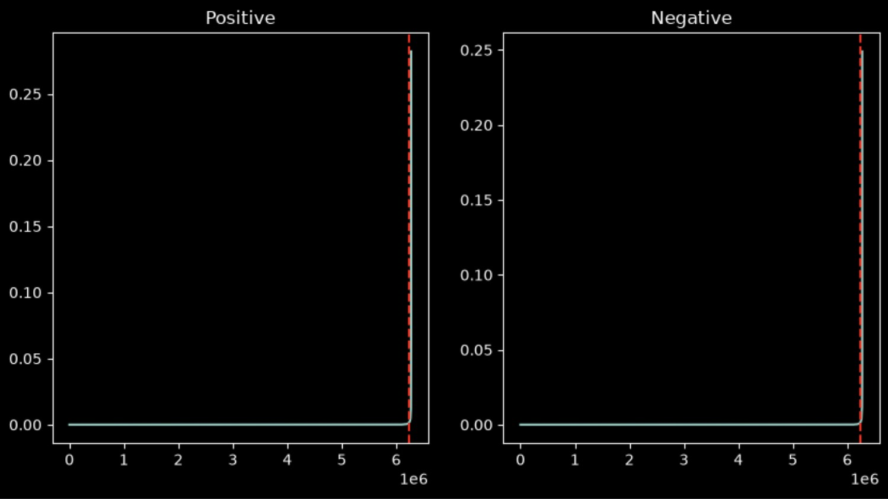{width="100%"}

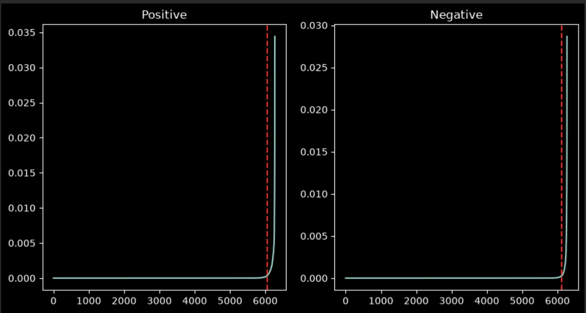{width="100%"}


Plots of attributions aggregated in different categories. The red line is the collected threshold.   
Negative Threshold plots use absolute values, and hence have positive values in `y` axis.  
The elbow was found by finding the point farthest from the line connecting the minimum value point to the maximum value point. 
:::

::: {.aside}
Attribution scores are known to follow highly skewed distributions — a small number of points carry disproportionately high attribution relative to the vast majority. 
:::

The simplest approach is to apply a global attribution threshold, determined by locating the elbow of the attribution distribution across all ImageNet target classes. We aggregate layer attributions for every example in our dataset (with respect to its target class) and identify the threshold at this elbow. The question is whether a single global threshold captures every pattern a neuron encounters. In our dataset, the answer is no.

For `mixed4e_1x1_pre_relu_conv:55`, using a global threshold caused us to miss all cat-related examples entirely. Given how prominently cats appear in feature visualizations, this is a major setback for this approach. This is why we use separate positive and negative thresholds for each category.


```{ojs}
//| echo: false


label_by_threshold = FileAttachment("./reports/thresholding/label_by_threshold.csv").csv({ typed: true })
Inputs.table(label_by_threshold, {
  format: {
    Positive: d3.format(".5f"),
    Negative: d3.format(".5f"),
  }
})
```


## Neuron Reports

- `mixed4e_1x1_pre_relu_conv`
  - `55` [Cluster Report](./reports/clusters/mixed4e_1x1_pre_relu_conv/55/index.html)
    - Dependency Reports:
      - [Cluster 31 (human faces in noise range)](./reports/dependency-reports/mixed4e_1x1_pre_relu_conv/55/31/report.qmd)
      - [Cluster 32 (human faces negative range)](./reports/dependency-reports/mixed4e_1x1_pre_relu_conv/55/32/report.qmd)
      - [Cluster 59 (cars)](./reports/dependency-reports/mixed4e_1x1_pre_relu_conv/55/59/report.qmd)
      - [Cluster 60 (foxes)](./reports/dependency-reports/mixed4e_1x1_pre_relu_conv/55/60/report.qmd)
      - [Cluster 61 (cats)](./reports/dependency-reports/mixed4e_1x1_pre_relu_conv/55/61/report.qmd)
  - `77` [Cluster Report](./reports/clusters/mixed4e_1x1_pre_relu_conv/77/index.html) 
    - [Dependency Report, cluster 22 (leopard)](./reports/dependency-reports/mixed4e_1x1_pre_relu_conv/77/22/report.qmd)
      - The first neuron is concerning. Clusters do look like they are finding some repeated pattern, it is not clear what they are though. Feature visualisations are also given for this neuron.
      - Many of the neurons are finding some patchy repeating patterns (patterns on snakes, birds, leopards). We also have a white fur match. We do see a lot of leopard patches too.
  - `25` [Cluster Report](./reports/clusters/mixed4e_1x1_pre_relu_conv/25/index.html)
    - [Dependency Report, cluster 15 (car wheels)](./reports/dependency-reports/mixed4e_1x1_pre_relu_conv/25/15/report.qmd)
      - A diverse class of circular features like `camera lens`, `bead-like` structures, `eyes`, `snout` and a lot of `wheels` are observed.  


- `mixed4d_3x3_pre_relu_conv`
  - `12` [Cluster Report](./reports/clusters/mixed4d_3x3_pre_relu_conv/12/index.html)
  - `45` [Cluster Report](./reports/clusters/mixed4d_3x3_pre_relu_conv/45/index.html)
  - `77` [Cluster Report](./reports/clusters/mixed4d_3x3_pre_relu_conv/77/index.html)
  - `150` [Cluster Report](./reports/clusters/mixed4d_3x3_pre_relu_conv/150/index.html)
  - `200` [Cluster Report](./reports/clusters/mixed4d_3x3_pre_relu_conv/200/index.html)
  - `229` [Cluster Report](./reports/clusters/mixed4d_3x3_pre_relu_conv/229/index.html)

- `mixed4d_5x5_pre_relu_conv`
  - `0` [Cluster Report](./reports/clusters/mixed4d_5x5_pre_relu_conv/0/index.html)
  - `10` [Cluster Report](./reports/clusters/mixed4d_5x5_pre_relu_conv/10/index.html)
  - `27` [Cluster Report](./reports/clusters/mixed4d_5x5_pre_relu_conv/27/index.html)


---

*Thanks to Shreya Rai for patiently listening to my many different and wrong theories, and to Paarth Dassani for feedback on this approach and the article. The dependency report generation code was mostly written by Claude Sonnet 5.0 (using Claude Code). A lot of research was done with Claude and Gemini.*