

<button type="button" id="origin-cluster-photo-toggle" class="btn btn-sm btn-outline-secondary" data-combined-src="assets/mixed4e_1x1_pre_relu_conv/55/cluster_32.jpeg" data-pw-src="assets/mixed4e_1x1_pre_relu_conv/55/cluster_32_third.jpeg" data-showing-pw="false" onclick="var btn=this; var img=document.getElementById('origin-cluster-photo-img'); var showingPw=btn.dataset.showingPw==='true'; img.src=showingPw?btn.dataset.combinedSrc:btn.dataset.pwSrc; btn.dataset.showingPw=(!showingPw).toString(); btn.textContent=showingPw?'Show pointwise multiplication':'Show cluster photo';">Show pointwise multiplication</button>

::: {.text-body-secondary .small .mb-3}
- frequently firing dependency neurons: **74**
- one-off/outlier dependency neurons (fired in fewer than **4** of **32** collected input images, not shown below): **59**
:::

::: {layout-ncol=2}

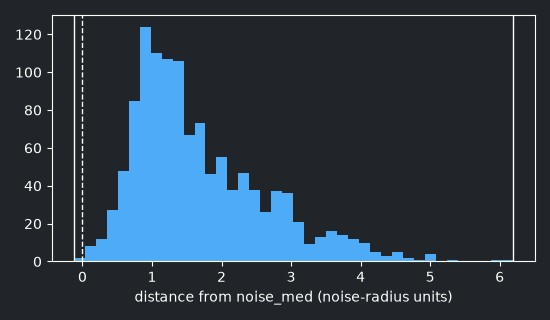

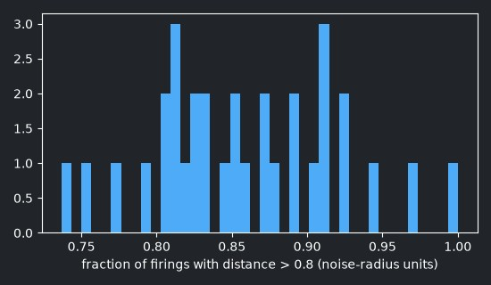

:::

::: {layout-ncol=2}

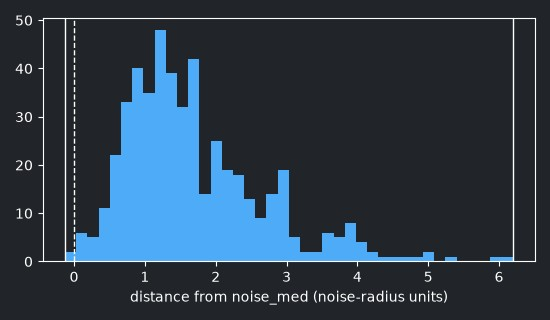

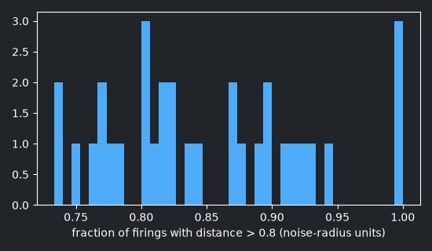

:::

::: {layout-ncol=2}

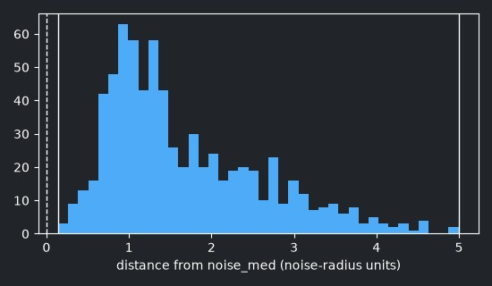

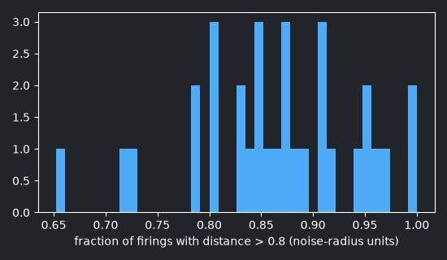

:::

## Frequently firing

::: {.border .rounded .mb-2 .p-3}

::: {.d-flex .flex-nowrap .align-items-center .justify-content-between .border-bottom .pb-2 .mb-2}
**mixed4d_5x5_pre_relu_conv:58** [· Fired: 100.0%]{.text-body-secondary .small}

{height=60px} [15.8% (↑15.8%)]{style="color: var(--bs-danger);"}
:::

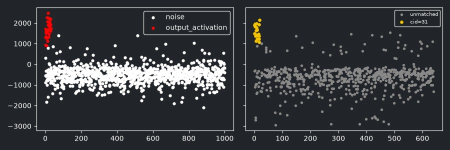

Firing by cluster

cid=31 · 32 (100.0%) · median_sim=0.96

show cluster photo

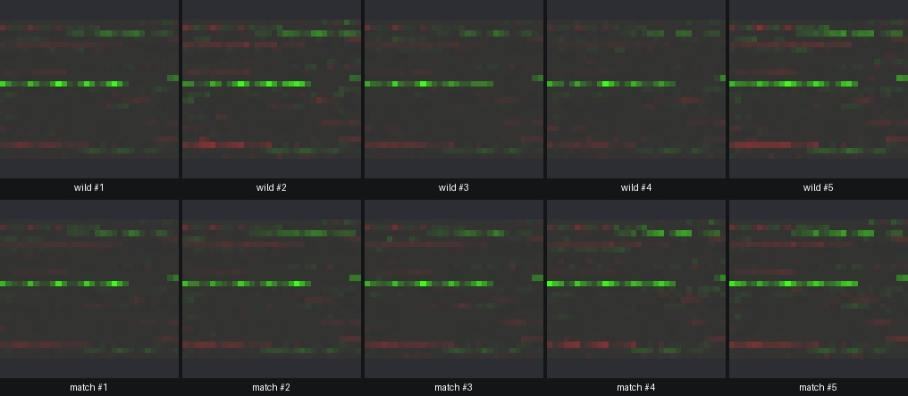

:::

::: {.border .rounded .mb-2 .p-3}

::: {.d-flex .flex-nowrap .align-items-center .justify-content-between .border-bottom .pb-2 .mb-2}
**mixed4d_3x3_pre_relu_conv:24** [· Fired: 100.0%]{.text-body-secondary .small}

{height=60px} [29.9% (↑14.0%)]{style="color: var(--bs-danger);"}
:::

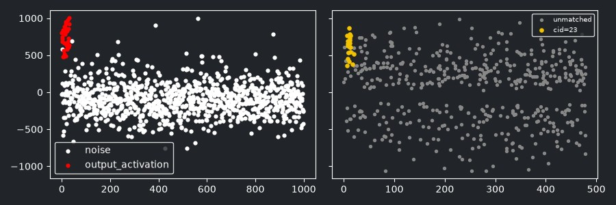

Firing by cluster

cid=23 · 32 (100.0%) · median_sim=0.92

show cluster photo

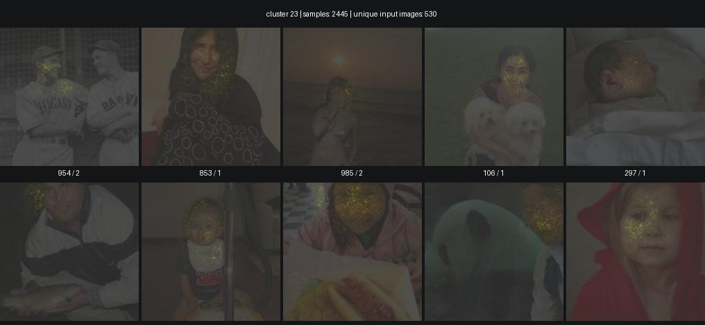

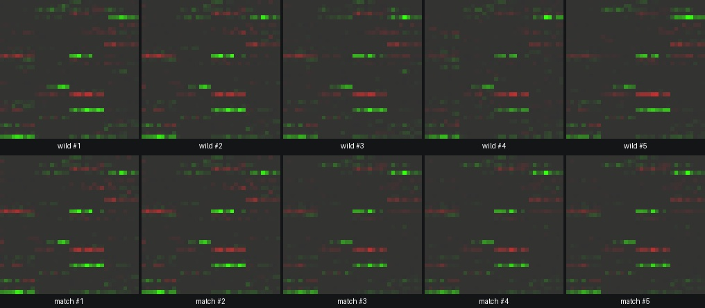

:::

::: {.border .rounded .mb-2 .p-3}

::: {.d-flex .flex-nowrap .align-items-center .justify-content-between .border-bottom .pb-2 .mb-2}
**mixed4d_3x3_pre_relu_conv:265** [· Fired: 100.0%]{.text-body-secondary .small}

{height=60px} [39.6% (↑9.7%)]{style="color: var(--bs-danger);"}
:::

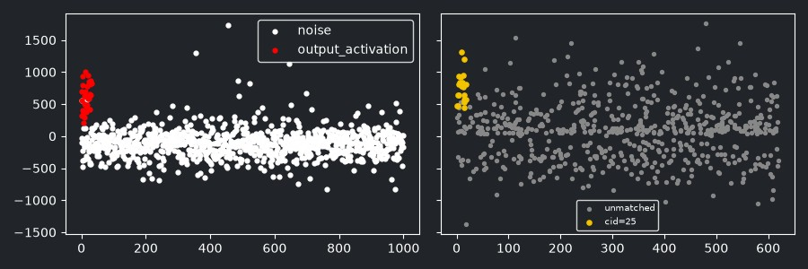

Firing by cluster

cid=25 · 32 (100.0%) · median_sim=0.88

show cluster photo

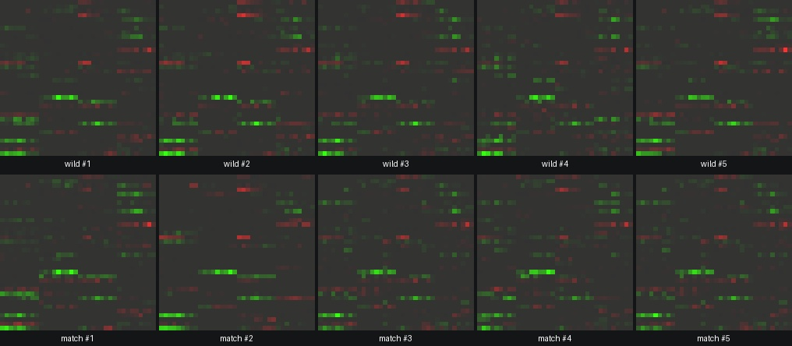

:::

::: {.border .rounded .mb-2 .p-3}

::: {.d-flex .flex-nowrap .align-items-center .justify-content-between .border-bottom .pb-2 .mb-2}
**mixed4d_3x3_pre_relu_conv:22** [· Fired: 100.0%]{.text-body-secondary .small}

[14.8% (↑14.8%)]{style="color: var(--bs-success);"} {height=60px}
:::

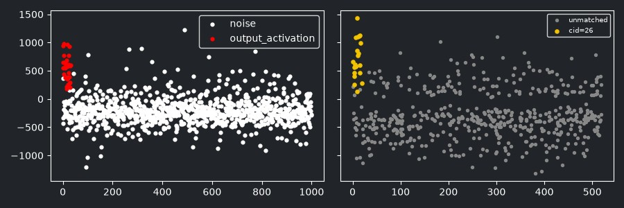

Firing by cluster

cid=26 · 32 (100.0%) · median_sim=0.93

show cluster photo

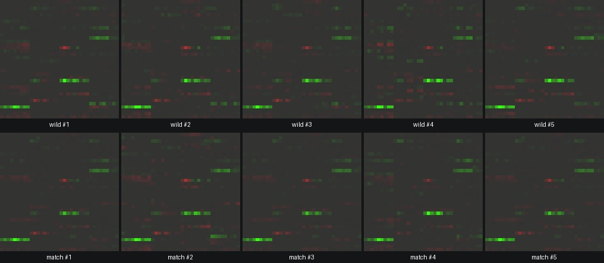

:::

::: {.border .rounded .mb-2 .p-3}

::: {.d-flex .flex-nowrap .align-items-center .justify-content-between .border-bottom .pb-2 .mb-2}
**mixed4d_5x5_pre_relu_conv:42** [· Fired: 100.0%]{.text-body-secondary .small}

[28.9% (↑14.1%)]{style="color: var(--bs-success);"} {height=60px}
:::

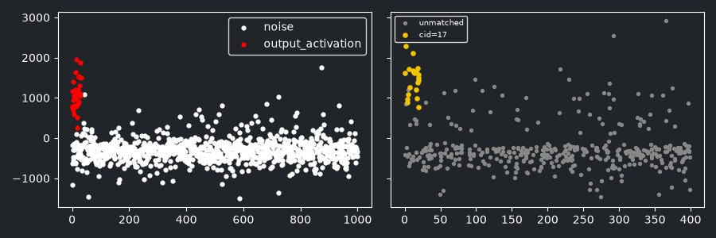

Firing by cluster

cid=17 · 32 (100.0%) · median_sim=0.93

show cluster photo

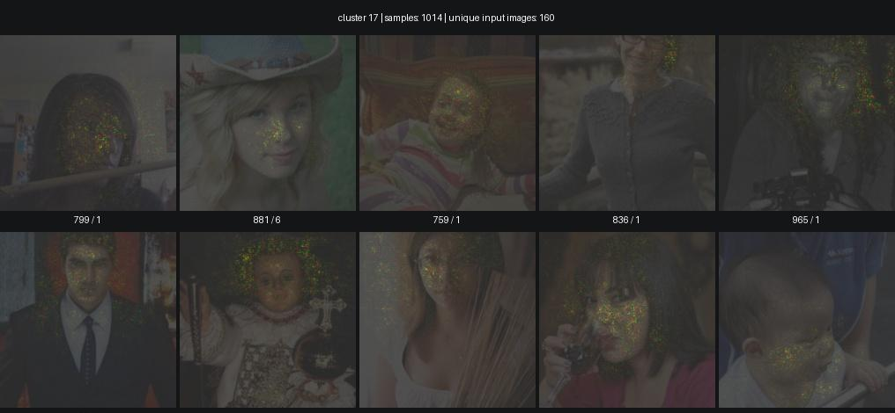

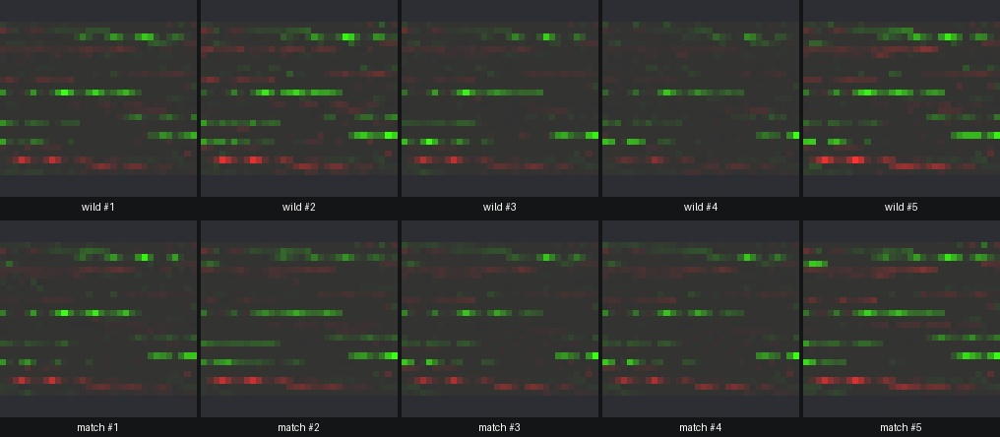

:::

::: {.border .rounded .mb-2 .p-3}

::: {.d-flex .flex-nowrap .align-items-center .justify-content-between .border-bottom .pb-2 .mb-2}
**mixed4d_3x3_pre_relu_conv:216** [· Fired: 100.0%]{.text-body-secondary .small}

[41.9% (↑13.0%)]{style="color: var(--bs-success);"} {height=60px}
:::

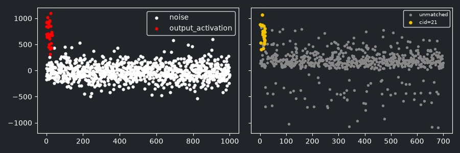

Firing by cluster

cid=21 · 32 (100.0%) · median_sim=0.85

show cluster photo

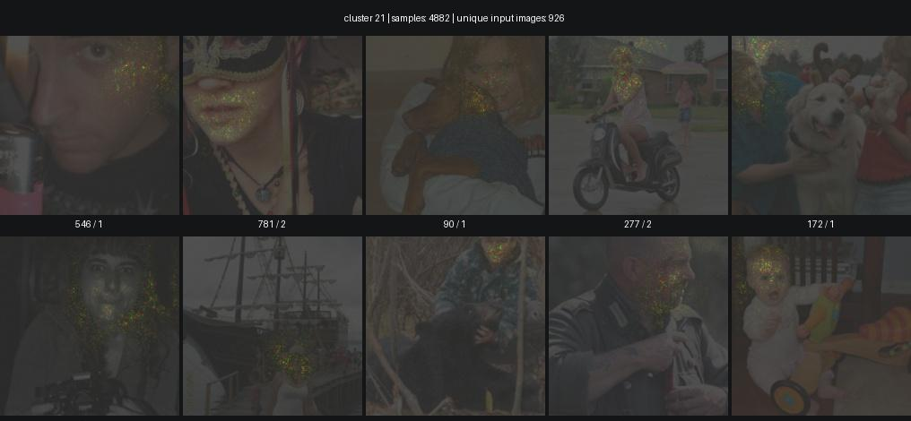

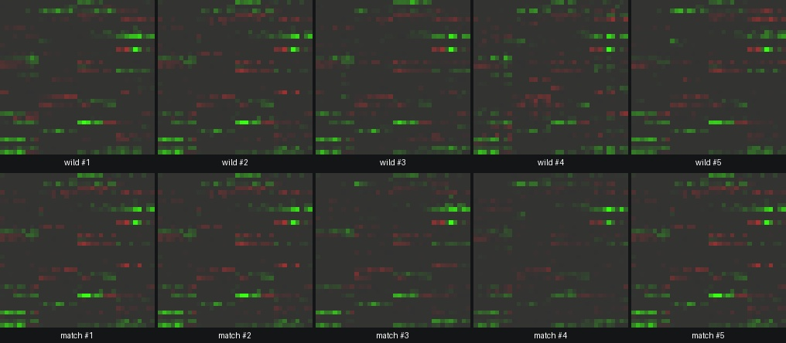

:::

::: {.border .rounded .mb-2 .p-3}

::: {.d-flex .flex-nowrap .align-items-center .justify-content-between .border-bottom .pb-2 .mb-2}
**mixed4d_3x3_pre_relu_conv:194** [· Fired: 100.0%]{.text-body-secondary .small}

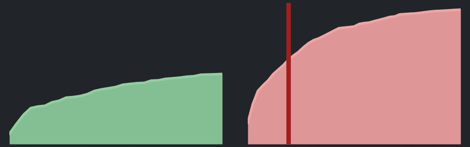{height=60px} [62.6% (↑3.9%)]{style="color: var(--bs-danger);"}
:::

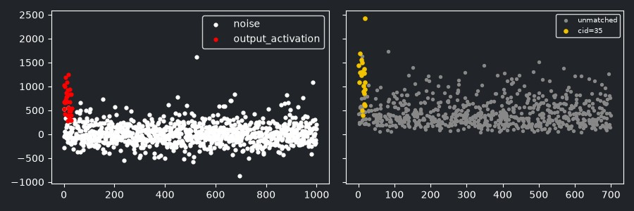

Firing by cluster

cid=35 · 32 (100.0%) · median_sim=0.90

show cluster photo

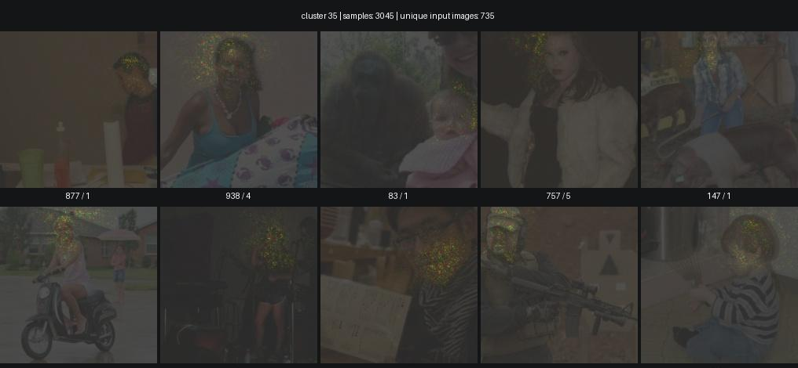

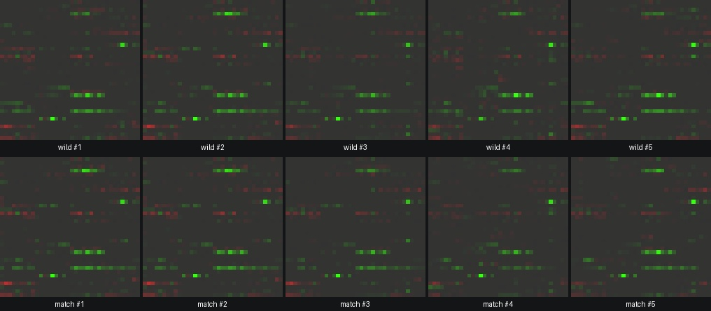

:::

::: {.border .rounded .mb-2 .p-3}

::: {.d-flex .flex-nowrap .align-items-center .justify-content-between .border-bottom .pb-2 .mb-2}
**mixed4d_3x3_pre_relu_conv:224** [· Fired: 100.0%]{.text-body-secondary .small}

{height=60px} [72.1% (↑3.5%)]{style="color: var(--bs-danger);"}
:::

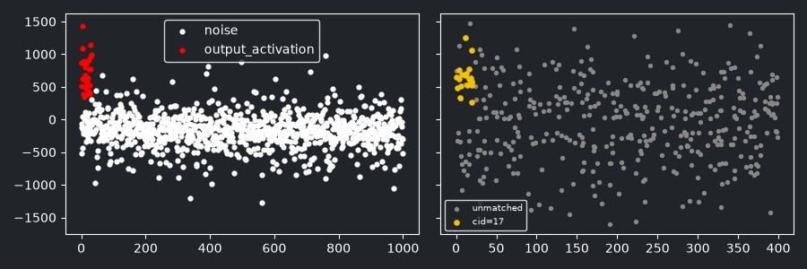

Firing by cluster

cid=17 · 32 (100.0%) · median_sim=0.91

show cluster photo

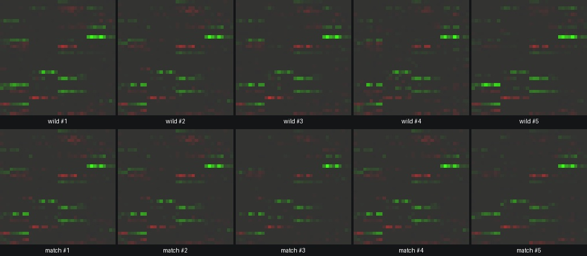

:::

::: {.border .rounded .mb-2 .p-3}

::: {.d-flex .flex-nowrap .align-items-center .justify-content-between .border-bottom .pb-2 .mb-2}
**mixed4d_1x1_pre_relu_conv:101** [· Fired: 96.9%]{.text-body-secondary .small}

[75.8% (↑4.6%)]{style="color: var(--bs-success);"} {height=60px}
:::

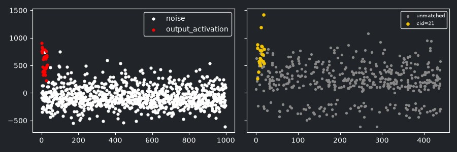

Firing by cluster

cid=21 · 31 (100.0%) · median_sim=0.87

show cluster photo

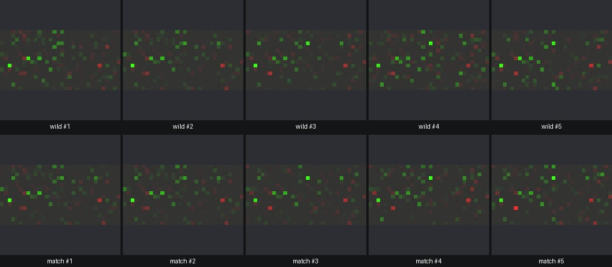

:::

::: {.border .rounded .mb-2 .p-3}

::: {.d-flex .flex-nowrap .align-items-center .justify-content-between .border-bottom .pb-2 .mb-2}
**mixed4d_5x5_pre_relu_conv:63** [· Fired: 93.8%]{.text-body-secondary .small}

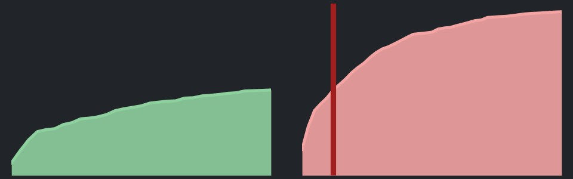{height=60px} [52.0% (↑4.7%)]{style="color: var(--bs-danger);"}
:::

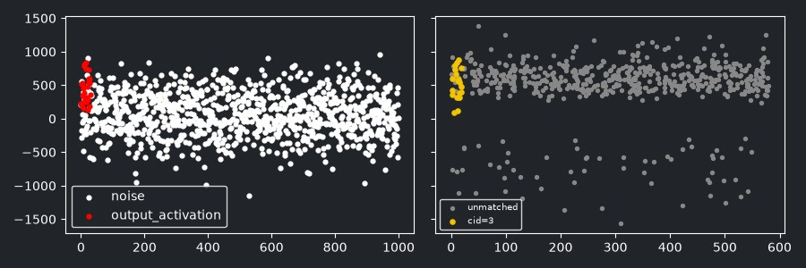

Firing by cluster

cid=3 · 30 (100.0%) · median_sim=0.92

show cluster photo

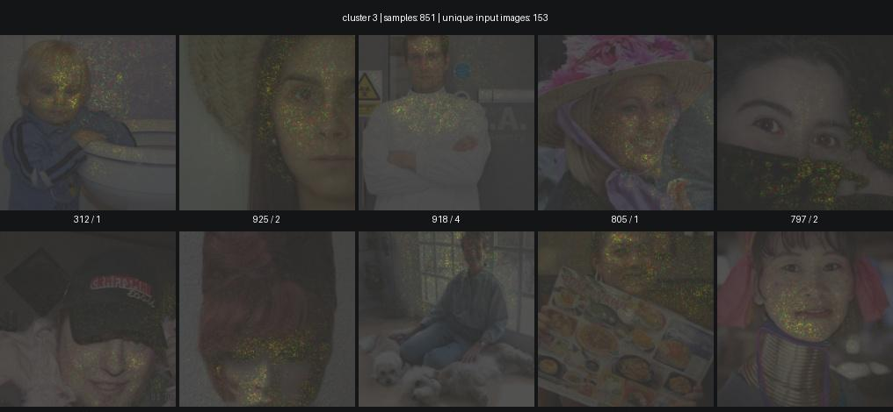

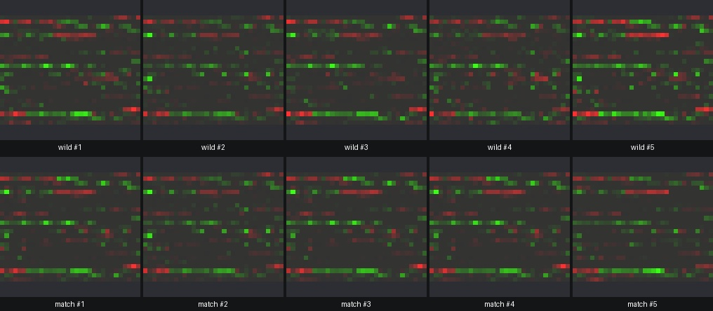

:::

::: {.border .rounded .mb-2 .p-3}

::: {.d-flex .flex-nowrap .align-items-center .justify-content-between .border-bottom .pb-2 .mb-2}
**mixed4d_3x3_pre_relu_conv:137** [· Fired: 93.8%]{.text-body-secondary .small}

{height=60px} [75.1% (↑3.0%)]{style="color: var(--bs-danger);"}
:::

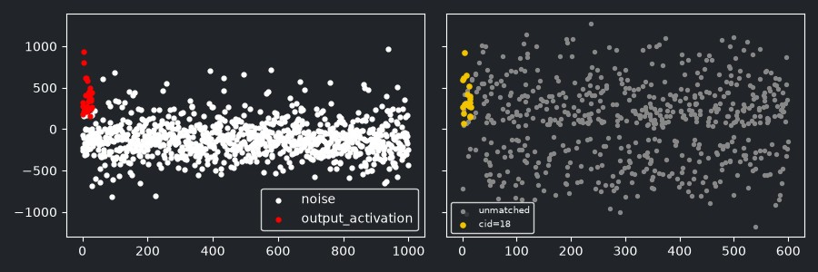

Firing by cluster

cid=18 · 30 (100.0%) · median_sim=0.89

show cluster photo

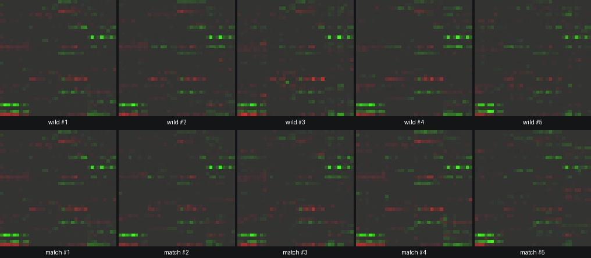

:::

::: {.border .rounded .mb-2 .p-3}

::: {.d-flex .flex-nowrap .align-items-center .justify-content-between .border-bottom .pb-2 .mb-2}
**mixed4d_3x3_pre_relu_conv:16** [· Fired: 90.6%]{.text-body-secondary .small}

[51.3% (↑9.4%)]{style="color: var(--bs-success);"} {height=60px}
:::

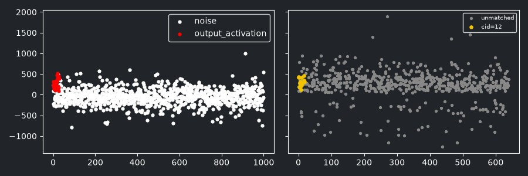

Firing by cluster

cid=12 · 29 (100.0%) · median_sim=0.93

show cluster photo

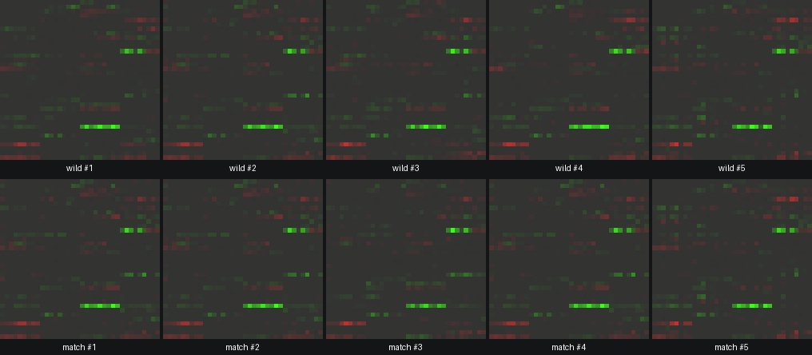

:::

::: {.border .rounded .mb-2 .p-3}

::: {.d-flex .flex-nowrap .align-items-center .justify-content-between .border-bottom .pb-2 .mb-2}
**mixed4d_1x1_pre_relu_conv:75** [· Fired: 90.6%]{.text-body-secondary .small}

[90.5% (↑3.2%)]{style="color: var(--bs-success);"} {height=60px}
:::

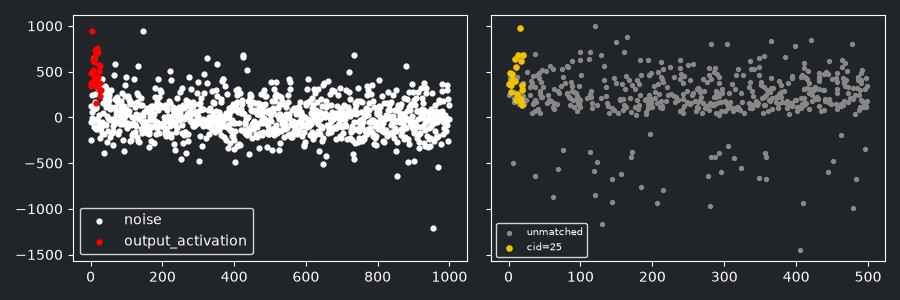

Firing by cluster

cid=25 · 29 (100.0%) · median_sim=0.91

show cluster photo

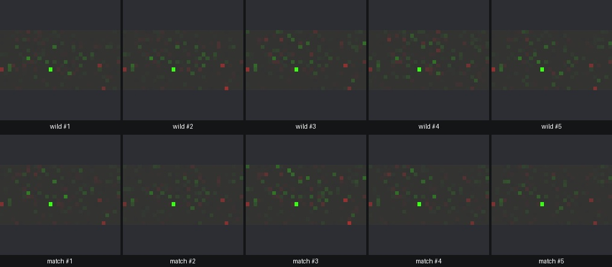

:::

::: {.border .rounded .mb-2 .p-3}

::: {.d-flex .flex-nowrap .align-items-center .justify-content-between .border-bottom .pb-2 .mb-2}
**mixed4d_3x3_pre_relu_conv:53** [· Fired: 87.5%]{.text-body-secondary .small}

{height=60px} [65.8% (↑3.2%)]{style="color: var(--bs-danger);"}
:::

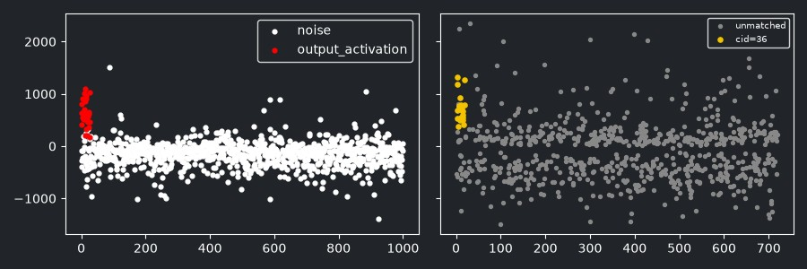

Firing by cluster

cid=36 · 28 (100.0%) · median_sim=0.95

show cluster photo

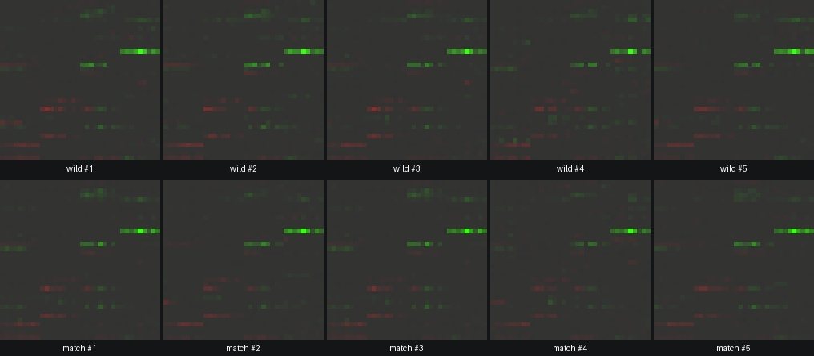

:::

::: {.border .rounded .mb-2 .p-3}

::: {.d-flex .flex-nowrap .align-items-center .justify-content-between .border-bottom .pb-2 .mb-2}
**mixed4d_3x3_pre_relu_conv:178** [· Fired: 84.4%]{.text-body-secondary .small}

{height=60px} [58.7% (↑3.4%)]{style="color: var(--bs-danger);"}
:::

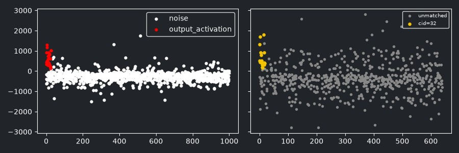

Firing by cluster

cid=32 · 27 (100.0%) · median_sim=0.96

show cluster photo

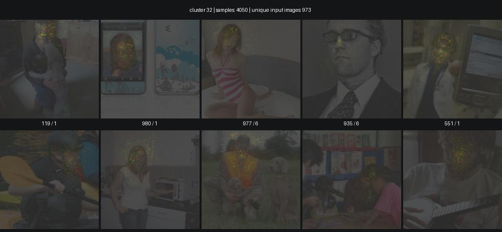

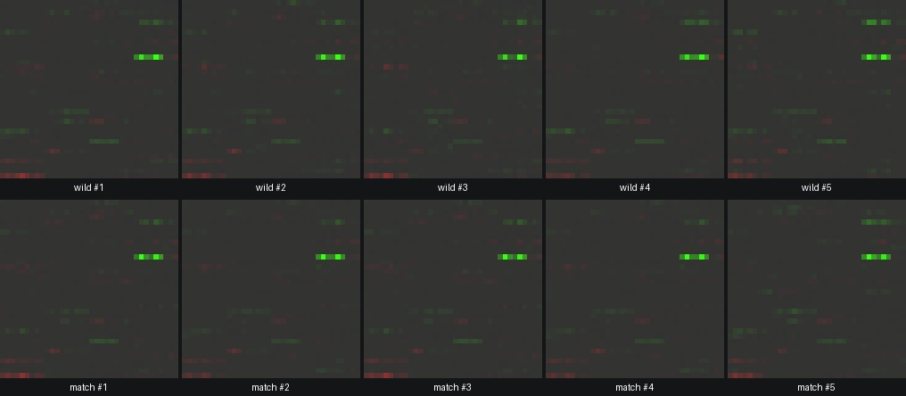

:::

::: {.border .rounded .mb-2 .p-3}

::: {.d-flex .flex-nowrap .align-items-center .justify-content-between .border-bottom .pb-2 .mb-2}
**mixed4d_3x3_pre_relu_conv:211** [· Fired: 81.2%]{.text-body-secondary .small}

[66.3% (↑4.5%)]{style="color: var(--bs-success);"} 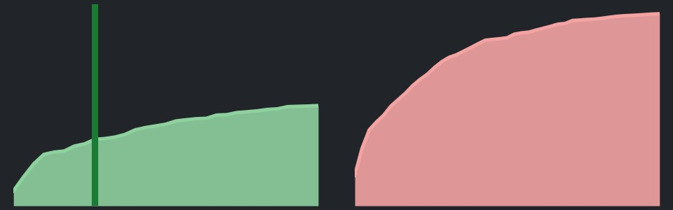{height=60px}
:::

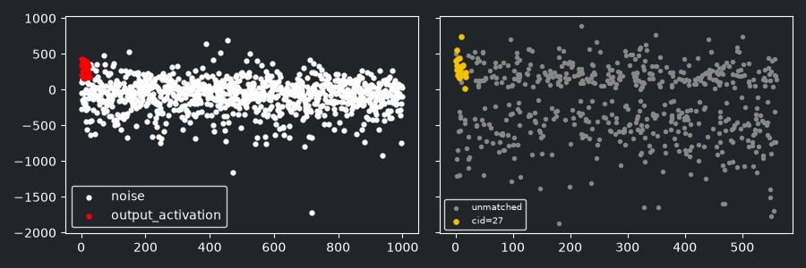

Firing by cluster

cid=27 · 24 (92.3%) · median_sim=0.96

show cluster photo

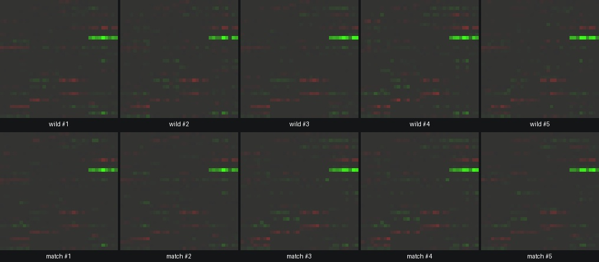

show outlier clusters (1)

cid=28 · 2 (7.7%) · median_sim=0.92 · outlier

show cluster photo

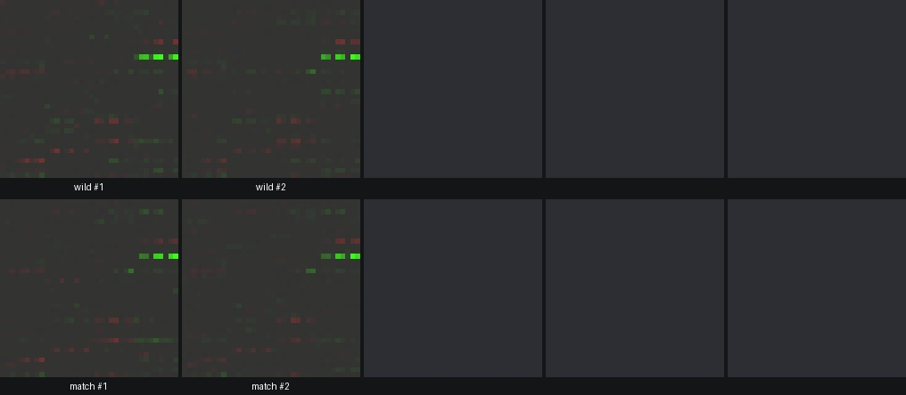

:::

::: {.border .rounded .mb-2 .p-3}

::: {.d-flex .flex-nowrap .align-items-center .justify-content-between .border-bottom .pb-2 .mb-2}
**mixed4d_1x1_pre_relu_conv:76** [· Fired: 81.2%]{.text-body-secondary .small}

[84.7% (↑3.2%)]{style="color: var(--bs-success);"} {height=60px}
:::

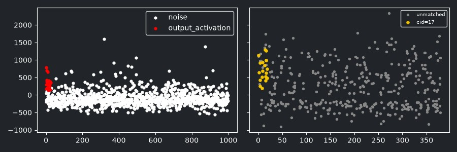

Firing by cluster

cid=17 · 26 (100.0%) · median_sim=0.91

show cluster photo

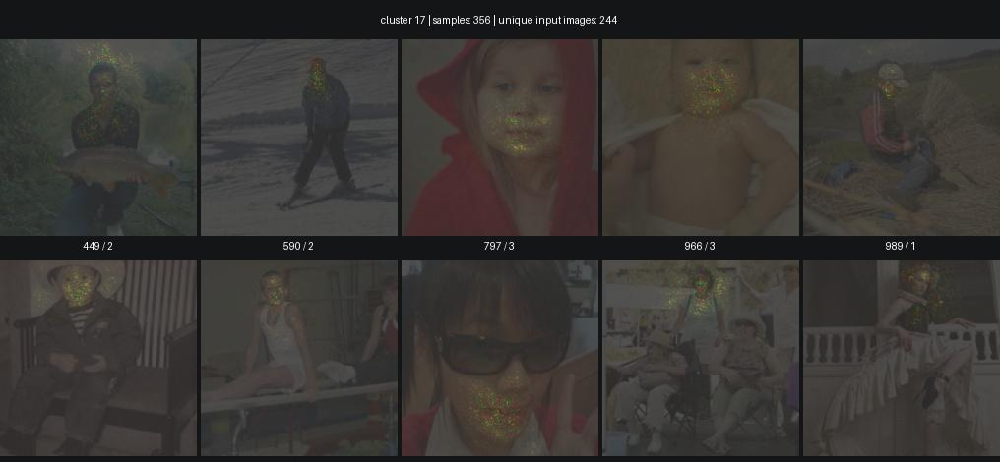


:::

::: {.border .rounded .mb-2 .p-3}

::: {.d-flex .flex-nowrap .align-items-center .justify-content-between .border-bottom .pb-2 .mb-2}
**mixed4d_5x5_pre_relu_conv:23** [· Fired: 81.2%]{.text-body-secondary .small}

[98.9% (↑2.1%)]{style="color: var(--bs-success);"} {height=60px}
:::


Firing by cluster

cid=17 · 23 (88.5%) · median_sim=0.91

show cluster photo


cid=18 · 3 (11.5%) · median_sim=0.90

show cluster photo


:::

::: {.border .rounded .mb-2 .p-3}

::: {.d-flex .flex-nowrap .align-items-center .justify-content-between .border-bottom .pb-2 .mb-2}
**mixed4d_1x1_pre_relu_conv:99** [· Fired: 78.1%]{.text-body-secondary .small}

{height=60px} [89.4% (↑1.9%)]{style="color: var(--bs-danger);"}
:::


Firing by cluster

cid=21 · 25 (100.0%) · median_sim=0.90

show cluster photo


:::

::: {.border .rounded .mb-2 .p-3}

::: {.d-flex .flex-nowrap .align-items-center .justify-content-between .border-bottom .pb-2 .mb-2}
**mixed4d_pool_reduce_pre_relu_conv:35** [· Fired: 78.1%]{.text-body-secondary .small}

{height=60px} [96.5% (↑1.5%)]{style="color: var(--bs-danger);"}
:::


Firing by cluster

cid=91 · 25 (100.0%) · median_sim=0.94

show cluster photo


:::

::: {.border .rounded .mb-2 .p-3}

::: {.d-flex .flex-nowrap .align-items-center .justify-content-between .border-bottom .pb-2 .mb-2}
**mixed4d_1x1_pre_relu_conv:86** [· Fired: 75.0%]{.text-body-secondary .small}

{height=60px} [68.5% (↑2.7%)]{style="color: var(--bs-danger);"}
:::


Firing by cluster

cid=6 · 24 (100.0%) · median_sim=0.91

show cluster photo


:::

::: {.border .rounded .mb-2 .p-3}

::: {.d-flex .flex-nowrap .align-items-center .justify-content-between .border-bottom .pb-2 .mb-2}
**mixed4d_3x3_pre_relu_conv:219** [· Fired: 75.0%]{.text-body-secondary .small}

{height=60px} [77.3% (↑2.2%)]{style="color: var(--bs-danger);"}
:::


Firing by cluster

cid=20 · 24 (100.0%) · median_sim=0.89

show cluster photo


:::

::: {.border .rounded .mb-2 .p-3}

::: {.d-flex .flex-nowrap .align-items-center .justify-content-between .border-bottom .pb-2 .mb-2}
**mixed4d_3x3_pre_relu_conv:15** [· Fired: 75.0%]{.text-body-secondary .small}

{height=60px} [84.4% (↑2.0%)]{style="color: var(--bs-danger);"}
:::


Firing by cluster

cid=23 · 24 (100.0%) · median_sim=0.91

show cluster photo


:::

::: {.border .rounded .mb-2 .p-3}

::: {.d-flex .flex-nowrap .align-items-center .justify-content-between .border-bottom .pb-2 .mb-2}
**mixed4d_5x5_pre_relu_conv:37** [· Fired: 71.9%]{.text-body-secondary .small}

[59.6% (↑4.9%)]{style="color: var(--bs-success);"} {height=60px}
:::


Firing by cluster

cid=19 · 23 (100.0%) · median_sim=0.92

show cluster photo


:::

::: {.border .rounded .mb-2 .p-3}

::: {.d-flex .flex-nowrap .align-items-center .justify-content-between .border-bottom .pb-2 .mb-2}
**mixed4d_3x3_pre_relu_conv:151** [· Fired: 71.9%]{.text-body-secondary .small}

{height=60px} [82.4% (↑1.9%)]{style="color: var(--bs-danger);"}
:::


Firing by cluster

cid=7 · 23 (100.0%) · median_sim=0.90

show cluster photo


:::

::: {.border .rounded .mb-2 .p-3}

::: {.d-flex .flex-nowrap .align-items-center .justify-content-between .border-bottom .pb-2 .mb-2}
**mixed4d_3x3_pre_relu_conv:282** [· Fired: 71.9%]{.text-body-secondary .small}

{height=60px} [86.3% (↑1.9%)]{style="color: var(--bs-danger);"}
:::


Firing by cluster

cid=9 · 23 (100.0%) · median_sim=0.90

show cluster photo


:::

::: {.border .rounded .mb-2 .p-3}

::: {.d-flex .flex-nowrap .align-items-center .justify-content-between .border-bottom .pb-2 .mb-2}
**mixed4d_pool_reduce_pre_relu_conv:40** [· Fired: 68.8%]{.text-body-secondary .small}

{height=60px} [43.7% (↑4.1%)]{style="color: var(--bs-danger);"}
:::


Firing by cluster

cid=128 · 22 (100.0%) · median_sim=0.89

show cluster photo


:::

::: {.border .rounded .mb-2 .p-3}

::: {.d-flex .flex-nowrap .align-items-center .justify-content-between .border-bottom .pb-2 .mb-2}
**mixed4d_pool_reduce_pre_relu_conv:19** [· Fired: 68.8%]{.text-body-secondary .small}

{height=60px} [47.3% (↑3.6%)]{style="color: var(--bs-danger);"}
:::


Firing by cluster

cid=85 · 22 (100.0%) · median_sim=0.96

show cluster photo


:::

::: {.border .rounded .mb-2 .p-3}

::: {.d-flex .flex-nowrap .align-items-center .justify-content-between .border-bottom .pb-2 .mb-2}
**mixed4d_5x5_pre_relu_conv:59** [· Fired: 68.8%]{.text-body-secondary .small}

{height=60px} [55.3% (↑3.3%)]{style="color: var(--bs-danger);"}
:::


Firing by cluster

cid=2 · 22 (100.0%) · median_sim=0.94

show cluster photo


:::

::: {.border .rounded .mb-2 .p-3}

::: {.d-flex .flex-nowrap .align-items-center .justify-content-between .border-bottom .pb-2 .mb-2}
**mixed4d_3x3_pre_relu_conv:52** [· Fired: 65.6%]{.text-body-secondary .small}

{height=60px} [80.5% (↑1.9%)]{style="color: var(--bs-danger);"}
:::


Firing by cluster

cid=31 · 21 (100.0%) · median_sim=0.92

show cluster photo


:::

::: {.border .rounded .mb-2 .p-3}

::: {.d-flex .flex-nowrap .align-items-center .justify-content-between .border-bottom .pb-2 .mb-2}
**mixed4d_5x5_pre_relu_conv:47** [· Fired: 62.5%]{.text-body-secondary .small}

[93.0% (↑2.1%)]{style="color: var(--bs-success);"} {height=60px}
:::


Firing by cluster

cid=10 · 20 (100.0%) · median_sim=0.94

show cluster photo


:::

::: {.border .rounded .mb-2 .p-3}

::: {.d-flex .flex-nowrap .align-items-center .justify-content-between .border-bottom .pb-2 .mb-2}
**mixed4d_1x1_pre_relu_conv:22** [· Fired: 53.1%]{.text-body-secondary .small}

[71.3% (↑2.7%)]{style="color: var(--bs-success);"} {height=60px}
:::


Firing by cluster

cid=5 · 16 (94.1%) · median_sim=0.68

show cluster photo


show outlier clusters (1)

cid=1 · 1 (5.9%) · median_sim=0.36 · outlier

show cluster photo


:::

::: {.border .rounded .mb-2 .p-3}

::: {.d-flex .flex-nowrap .align-items-center .justify-content-between .border-bottom .pb-2 .mb-2}
**mixed4d_5x5_pre_relu_conv:61** [· Fired: 53.1%]{.text-body-secondary .small}

[78.1% (↑2.2%)]{style="color: var(--bs-success);"} {height=60px}
:::


Firing by cluster

cid=23 · 17 (100.0%) · median_sim=0.97

show cluster photo


:::

::: {.border .rounded .mb-2 .p-3}

::: {.d-flex .flex-nowrap .align-items-center .justify-content-between .border-bottom .pb-2 .mb-2}
**mixed4d_5x5_pre_relu_conv:40** [· Fired: 53.1%]{.text-body-secondary .small}

{height=60px} [94.6% (↑1.1%)]{style="color: var(--bs-danger);"}
:::


Firing by cluster

cid=5 · 17 (100.0%) · median_sim=0.91

show cluster photo


:::

::: {.border .rounded .mb-2 .p-3}

::: {.d-flex .flex-nowrap .align-items-center .justify-content-between .border-bottom .pb-2 .mb-2}
**mixed4d_1x1_pre_relu_conv:100** [· Fired: 50.0%]{.text-body-secondary .small}

[96.1% (↑1.4%)]{style="color: var(--bs-success);"} {height=60px}
:::


Firing by cluster

cid=0 · 16 (100.0%) · median_sim=0.85

show cluster photo


:::

::: {.border .rounded .mb-2 .p-3}

::: {.d-flex .flex-nowrap .align-items-center .justify-content-between .border-bottom .pb-2 .mb-2}
**mixed4d_pool_reduce_pre_relu_conv:9** [· Fired: 46.9%]{.text-body-secondary .small}

{height=60px} [78.6% (↑1.3%)]{style="color: var(--bs-danger);"}
:::


Firing by cluster

cid=75 · 15 (100.0%) · median_sim=0.92

show cluster photo


:::

::: {.border .rounded .mb-2 .p-3}

::: {.d-flex .flex-nowrap .align-items-center .justify-content-between .border-bottom .pb-2 .mb-2}
**mixed4d_3x3_pre_relu_conv:144** [· Fired: 46.9%]{.text-body-secondary .small}

{height=60px} [91.5% (↑1.1%)]{style="color: var(--bs-danger);"}
:::


Firing by cluster

cid=21 · 15 (100.0%) · median_sim=0.83

show cluster photo


:::

::: {.border .rounded .mb-2 .p-3}

::: {.d-flex .flex-nowrap .align-items-center .justify-content-between .border-bottom .pb-2 .mb-2}
**mixed4d_3x3_pre_relu_conv:268** [· Fired: 46.9%]{.text-body-secondary .small}

{height=60px} [93.5% (↑1.0%)]{style="color: var(--bs-danger);"}
:::


Firing by cluster

cid=35 · 15 (100.0%) · median_sim=0.92

show cluster photo


:::

::: {.border .rounded .mb-2 .p-3}

::: {.d-flex .flex-nowrap .align-items-center .justify-content-between .border-bottom .pb-2 .mb-2}
**mixed4d_pool_reduce_pre_relu_conv:59** [· Fired: 43.8%]{.text-body-secondary .small}

{height=60px} [92.5% (↑1.0%)]{style="color: var(--bs-danger);"}
:::


Firing by cluster

cid=38 · 9 (64.3%) · median_sim=0.95

show cluster photo


cid=39 · 5 (35.7%) · median_sim=0.96

show cluster photo


:::

::: {.border .rounded .mb-2 .p-3}

::: {.d-flex .flex-nowrap .align-items-center .justify-content-between .border-bottom .pb-2 .mb-2}
**mixed4d_1x1_pre_relu_conv:47** [· Fired: 43.8%]{.text-body-secondary .small}

[81.4% (↑1.7%)]{style="color: var(--bs-success);"} {height=60px}
:::


Firing by cluster

cid=8 · 10 (71.4%) · median_sim=0.85

show cluster photo


cid=9 · 4 (28.6%) · median_sim=0.83

show cluster photo


:::

::: {.border .rounded .mb-2 .p-3}

::: {.d-flex .flex-nowrap .align-items-center .justify-content-between .border-bottom .pb-2 .mb-2}
**mixed4d_1x1_pre_relu_conv:44** [· Fired: 40.6%]{.text-body-secondary .small}

[79.7% (↑1.6%)]{style="color: var(--bs-success);"} {height=60px}
:::


Firing by cluster

cid=3 · 8 (61.5%) · median_sim=0.71

show cluster photo


cid=2 · 4 (30.8%) · median_sim=0.43

show cluster photo


show outlier clusters (1)

cid=1 · 1 (7.7%) · median_sim=0.40 · outlier

show cluster photo


:::

::: {.border .rounded .mb-2 .p-3}

::: {.d-flex .flex-nowrap .align-items-center .justify-content-between .border-bottom .pb-2 .mb-2}
**mixed4d_5x5_pre_relu_conv:45** [· Fired: 34.4%]{.text-body-secondary .small}

[61.8% (↑2.2%)]{style="color: var(--bs-success);"} {height=60px}
:::


Firing by cluster

cid=3 · 11 (100.0%) · median_sim=0.88

show cluster photo


:::

::: {.border .rounded .mb-2 .p-3}

::: {.d-flex .flex-nowrap .align-items-center .justify-content-between .border-bottom .pb-2 .mb-2}
**mixed4d_3x3_pre_relu_conv:98** [· Fired: 34.4%]{.text-body-secondary .small}

{height=60px} [98.2% (↑0.5%)]{style="color: var(--bs-danger);"}
:::


Firing by cluster

cid=22 · 11 (100.0%) · median_sim=0.94

show cluster photo


:::

::: {.border .rounded .mb-2 .p-3}

::: {.d-flex .flex-nowrap .align-items-center .justify-content-between .border-bottom .pb-2 .mb-2}
**mixed4d_1x1_pre_relu_conv:104** [· Fired: 34.4%]{.text-body-secondary .small}

{height=60px} [98.6% (↑0.5%)]{style="color: var(--bs-danger);"}
:::


Firing by cluster

cid=8 · 11 (100.0%) · median_sim=0.89

show cluster photo


:::

::: {.border .rounded .mb-2 .p-3}

::: {.d-flex .flex-nowrap .align-items-center .justify-content-between .border-bottom .pb-2 .mb-2}
**mixed4d_1x1_pre_relu_conv:1** [· Fired: 31.2%]{.text-body-secondary .small}

[85.8% (↑1.2%)]{style="color: var(--bs-success);"} {height=60px}
:::


Firing by cluster

cid=16 · 10 (100.0%) · median_sim=0.94

show cluster photo


:::

::: {.border .rounded .mb-2 .p-3}

::: {.d-flex .flex-nowrap .align-items-center .justify-content-between .border-bottom .pb-2 .mb-2}
**mixed4d_pool_reduce_pre_relu_conv:47** [· Fired: 28.1%]{.text-body-secondary .small}

[53.6% (↑2.3%)]{style="color: var(--bs-success);"} {height=60px}
:::


Firing by cluster

cid=45 · 9 (100.0%) · median_sim=0.95

show cluster photo


:::

::: {.border .rounded .mb-2 .p-3}

::: {.d-flex .flex-nowrap .align-items-center .justify-content-between .border-bottom .pb-2 .mb-2}
**mixed4d_3x3_pre_relu_conv:81** [· Fired: 28.1%]{.text-body-secondary .small}

[68.6% (↑1.5%)]{style="color: var(--bs-success);"} {height=60px}
:::


Firing by cluster

cid=22 · 9 (100.0%) · median_sim=0.90

show cluster photo


:::

::: {.border .rounded .mb-2 .p-3}

::: {.d-flex .flex-nowrap .align-items-center .justify-content-between .border-bottom .pb-2 .mb-2}
**mixed4d_1x1_pre_relu_conv:63** [· Fired: 28.1%]{.text-body-secondary .small}

{height=60px} [90.1% (↑0.7%)]{style="color: var(--bs-danger);"}
:::


Firing by cluster

cid=10 · 5 (55.6%) · median_sim=0.87

show cluster photo


cid=8 · 3 (33.3%) · median_sim=0.86

show cluster photo


cid=7 · 1 (11.1%) · median_sim=0.78

show cluster photo


:::

::: {.border .rounded .mb-2 .p-3}

::: {.d-flex .flex-nowrap .align-items-center .justify-content-between .border-bottom .pb-2 .mb-2}
**mixed4d_3x3_pre_relu_conv:10** [· Fired: 28.1%]{.text-body-secondary .small}

[86.9% (↑1.0%)]{style="color: var(--bs-success);"} {height=60px}
:::


Firing by cluster

cid=16 · 9 (100.0%) · median_sim=0.92

show cluster photo


:::

::: {.border .rounded .mb-2 .p-3}

::: {.d-flex .flex-nowrap .align-items-center .justify-content-between .border-bottom .pb-2 .mb-2}
**mixed4d_5x5_pre_relu_conv:1** [· Fired: 28.1%]{.text-body-secondary .small}

[94.7% (↑0.9%)]{style="color: var(--bs-success);"} {height=60px}
:::


Firing by cluster

cid=15 · 9 (100.0%) · median_sim=0.94

show cluster photo


:::

::: {.border .rounded .mb-2 .p-3}

::: {.d-flex .flex-nowrap .align-items-center .justify-content-between .border-bottom .pb-2 .mb-2}
**mixed4d_3x3_pre_relu_conv:170** [· Fired: 28.1%]{.text-body-secondary .small}

{height=60px} [97.6% (↑0.4%)]{style="color: var(--bs-danger);"}
:::


Firing by cluster

cid=8 · 9 (100.0%) · median_sim=0.89

show cluster photo


:::

::: {.border .rounded .mb-2 .p-3}

::: {.d-flex .flex-nowrap .align-items-center .justify-content-between .border-bottom .pb-2 .mb-2}
**mixed4d_1x1_pre_relu_conv:111** [· Fired: 25.0%]{.text-body-secondary .small}

[93.8% (↑0.8%)]{style="color: var(--bs-success);"} {height=60px}
:::


Firing by cluster

cid=6 · 8 (100.0%) · median_sim=0.89

show cluster photo


:::

::: {.border .rounded .mb-2 .p-3}

::: {.d-flex .flex-nowrap .align-items-center .justify-content-between .border-bottom .pb-2 .mb-2}
**mixed4d_3x3_pre_relu_conv:160** [· Fired: 25.0%]{.text-body-secondary .small}

[96.8% (↑0.7%)]{style="color: var(--bs-success);"} {height=60px}
:::


Firing by cluster

cid=8 · 8 (100.0%) · median_sim=0.86

show cluster photo


:::

::: {.border .rounded .mb-2 .p-3}

::: {.d-flex .flex-nowrap .align-items-center .justify-content-between .border-bottom .pb-2 .mb-2}
**mixed4d_5x5_pre_relu_conv:33** [· Fired: 21.9%]{.text-body-secondary .small}

{height=60px} [99.0% (↑0.3%)]{style="color: var(--bs-danger);"}
:::


Firing by cluster

cid=23 · 7 (100.0%) · median_sim=0.94

show cluster photo


:::

::: {.border .rounded .mb-2 .p-3}

::: {.d-flex .flex-nowrap .align-items-center .justify-content-between .border-bottom .pb-2 .mb-2}
**mixed4d_3x3_pre_relu_conv:21** [· Fired: 21.9%]{.text-body-secondary .small}

{height=60px} [99.9% (↑0.3%)]{style="color: var(--bs-danger);"}
:::


Firing by cluster

cid=10 · 7 (100.0%) · median_sim=0.85

show cluster photo


:::

::: {.border .rounded .mb-2 .p-3}

::: {.d-flex .flex-nowrap .align-items-center .justify-content-between .border-bottom .pb-2 .mb-2}
**mixed4d_3x3_pre_relu_conv:27** [· Fired: 21.9%]{.text-body-secondary .small}

[100.0% (↑0.5%)]{style="color: var(--bs-success);"} {height=60px}
:::


Firing by cluster

cid=20 · 7 (100.0%) · median_sim=0.86

show cluster photo


:::

::: {.border .rounded .mb-2 .p-3}

::: {.d-flex .flex-nowrap .align-items-center .justify-content-between .border-bottom .pb-2 .mb-2}
**mixed4d_1x1_pre_relu_conv:43** [· Fired: 18.8%]{.text-body-secondary .small}

{height=60px} [87.5% (↑0.5%)]{style="color: var(--bs-danger);"}
:::


Firing by cluster

cid=34 · 4 (66.7%) · median_sim=0.78

show cluster photo


cid=35 · 2 (33.3%) · median_sim=0.93

show cluster photo


:::

::: {.border .rounded .mb-2 .p-3}

::: {.d-flex .flex-nowrap .align-items-center .justify-content-between .border-bottom .pb-2 .mb-2}
**mixed4d_3x3_pre_relu_conv:153** [· Fired: 18.8%]{.text-body-secondary .small}

{height=60px} [95.0% (↑0.4%)]{style="color: var(--bs-danger);"}
:::


Firing by cluster

cid=14 · 6 (100.0%) · median_sim=0.87

show cluster photo


:::

::: {.border .rounded .mb-2 .p-3}

::: {.d-flex .flex-nowrap .align-items-center .justify-content-between .border-bottom .pb-2 .mb-2}
**mixed4d_5x5_pre_relu_conv:34** [· Fired: 18.8%]{.text-body-secondary .small}

{height=60px} [97.0% (↑0.3%)]{style="color: var(--bs-danger);"}
:::


Firing by cluster

cid=13 · 6 (100.0%) · median_sim=0.93

show cluster photo


:::

::: {.border .rounded .mb-2 .p-3}

::: {.d-flex .flex-nowrap .align-items-center .justify-content-between .border-bottom .pb-2 .mb-2}
**mixed4d_3x3_pre_relu_conv:257** [· Fired: 18.8%]{.text-body-secondary .small}

{height=60px} [99.6% (↑0.2%)]{style="color: var(--bs-danger);"}
:::


Firing by cluster

cid=5 · 6 (100.0%) · median_sim=0.90

show cluster photo


:::

::: {.border .rounded .mb-2 .p-3}

::: {.d-flex .flex-nowrap .align-items-center .justify-content-between .border-bottom .pb-2 .mb-2}
**mixed4d_1x1_pre_relu_conv:61** [· Fired: 15.6%]{.text-body-secondary .small}

[54.7% (↑1.1%)]{style="color: var(--bs-success);"} {height=60px}
:::


Firing by cluster

cid=30 · 5 (100.0%) · median_sim=0.84

show cluster photo


:::

::: {.border .rounded .mb-2 .p-3}

::: {.d-flex .flex-nowrap .align-items-center .justify-content-between .border-bottom .pb-2 .mb-2}
**mixed4d_pool_reduce_pre_relu_conv:54** [· Fired: 15.6%]{.text-body-secondary .small}

[67.1% (↑0.9%)]{style="color: var(--bs-success);"} {height=60px}
:::


Firing by cluster

cid=89 · 5 (100.0%) · median_sim=0.90

show cluster photo


:::

::: {.border .rounded .mb-2 .p-3}

::: {.d-flex .flex-nowrap .align-items-center .justify-content-between .border-bottom .pb-2 .mb-2}
**mixed4d_pool_reduce_pre_relu_conv:60** [· Fired: 15.6%]{.text-body-secondary .small}

{height=60px} [86.7% (↑0.4%)]{style="color: var(--bs-danger);"}
:::


Firing by cluster

cid=56 · 4 (80.0%) · median_sim=0.75

show cluster photo


cid=80 · 1 (20.0%) · median_sim=0.71

show cluster photo


:::

::: {.border .rounded .mb-2 .p-3}

::: {.d-flex .flex-nowrap .align-items-center .justify-content-between .border-bottom .pb-2 .mb-2}
**mixed4d_3x3_pre_relu_conv:79** [· Fired: 15.6%]{.text-body-secondary .small}

{height=60px} [87.0% (↑0.4%)]{style="color: var(--bs-danger);"}
:::


Firing by cluster

cid=25 · 5 (100.0%) · median_sim=0.89

show cluster photo


:::

::: {.border .rounded .mb-2 .p-3}

::: {.d-flex .flex-nowrap .align-items-center .justify-content-between .border-bottom .pb-2 .mb-2}
**mixed4d_5x5_pre_relu_conv:32** [· Fired: 15.6%]{.text-body-secondary .small}

{height=60px} [90.4% (↑0.4%)]{style="color: var(--bs-danger);"}
:::


Firing by cluster

cid=28 · 5 (100.0%) · median_sim=0.95

show cluster photo


:::

::: {.border .rounded .mb-2 .p-3}

::: {.d-flex .flex-nowrap .align-items-center .justify-content-between .border-bottom .pb-2 .mb-2}
**mixed4d_1x1_pre_relu_conv:52** [· Fired: 15.6%]{.text-body-secondary .small}

{height=60px} [96.7% (↑0.3%)]{style="color: var(--bs-danger);"}
:::


Firing by cluster

cid=4 · 5 (100.0%) · median_sim=0.82

show cluster photo


:::

::: {.border .rounded .mb-2 .p-3}

::: {.d-flex .flex-nowrap .align-items-center .justify-content-between .border-bottom .pb-2 .mb-2}
**mixed4d_3x3_pre_relu_conv:217** [· Fired: 15.6%]{.text-body-secondary .small}

{height=60px} [99.4% (↑0.2%)]{style="color: var(--bs-danger);"}
:::


Firing by cluster

cid=4 · 5 (100.0%) · median_sim=0.90

show cluster photo


:::

::: {.border .rounded .mb-2 .p-3}

::: {.d-flex .flex-nowrap .align-items-center .justify-content-between .border-bottom .pb-2 .mb-2}
**mixed4d_1x1_pre_relu_conv:9** [· Fired: 12.5%]{.text-body-secondary .small}

[87.3% (↑0.5%)]{style="color: var(--bs-success);"} {height=60px}
:::


Firing by cluster

cid=9 · 4 (100.0%) · median_sim=0.77

show cluster photo


:::

::: {.border .rounded .mb-2 .p-3}

::: {.d-flex .flex-nowrap .align-items-center .justify-content-between .border-bottom .pb-2 .mb-2}
**mixed4d_3x3_pre_relu_conv:188** [· Fired: 12.5%]{.text-body-secondary .small}

[90.9% (↑0.4%)]{style="color: var(--bs-success);"} {height=60px}
:::


Firing by cluster

cid=17 · 3 (75.0%) · median_sim=0.89

show cluster photo


cid=11 · 1 (25.0%) · median_sim=0.84

show cluster photo


:::

::: {.border .rounded .mb-2 .p-3}

::: {.d-flex .flex-nowrap .align-items-center .justify-content-between .border-bottom .pb-2 .mb-2}
**mixed4d_1x1_pre_relu_conv:35** [· Fired: 12.5%]{.text-body-secondary .small}

{height=60px} [97.2% (↑0.2%)]{style="color: var(--bs-danger);"}
:::


Firing by cluster

cid=14 · 1 (25.0%) · median_sim=0.66

show cluster photo


cid=13 · 1 (25.0%) · median_sim=0.59

show cluster photo


cid=8 · 1 (25.0%) · median_sim=0.46

show cluster photo


cid=4 · 1 (25.0%) · median_sim=0.46

show cluster photo


:::

::: {.border .rounded .mb-2 .p-3}

::: {.d-flex .flex-nowrap .align-items-center .justify-content-between .border-bottom .pb-2 .mb-2}
**mixed4d_1x1_pre_relu_conv:14** [· Fired: 12.5%]{.text-body-secondary .small}

{height=60px} [99.1% (↑0.2%)]{style="color: var(--bs-danger);"}
:::


Firing by cluster

cid=14 · 4 (100.0%) · median_sim=0.85

show cluster photo


:::

::: {.border .rounded .mb-2 .p-3}

::: {.d-flex .flex-nowrap .align-items-center .justify-content-between .border-bottom .pb-2 .mb-2}
**mixed4d_1x1_pre_relu_conv:11** [· Fired: 12.5%]{.text-body-secondary .small}

[99.3% (↑0.3%)]{style="color: var(--bs-success);"} {height=60px}
:::


Firing by cluster

cid=26 · 4 (100.0%) · median_sim=0.88

show cluster photo


:::

::: {.border .rounded .mb-2 .p-3}

::: {.d-flex .flex-nowrap .align-items-center .justify-content-between .border-bottom .pb-2 .mb-2}
**mixed4d_1x1_pre_relu_conv:50** [· Fired: 12.5%]{.text-body-secondary .small}

[99.5% (↑0.3%)]{style="color: var(--bs-success);"} {height=60px}
:::


Firing by cluster

cid=8 · 4 (100.0%) · median_sim=0.97

show cluster photo


:::

::: {.border .rounded .mb-2 .p-3}

::: {.d-flex .flex-nowrap .align-items-center .justify-content-between .border-bottom .pb-2 .mb-2}
**mixed4d_3x3_pre_relu_conv:166** [· Fired: 12.5%]{.text-body-secondary .small}

{height=60px} [100.0% (↑0.1%)]{style="color: var(--bs-danger);"}
:::


Firing by cluster

cid=11 · 4 (100.0%) · median_sim=0.83

show cluster photo


:::
